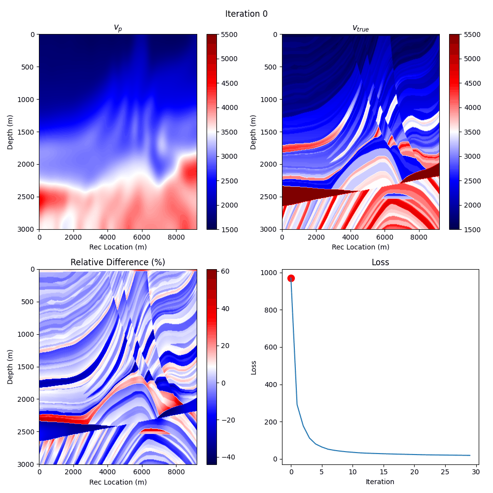

1
=

.. toctree::
   :maxdepth: 4
   :caption: Contents:

Metadata
--------

.. admonition:: Metadata
  :class: toggle

  .. admonition:: score
    :class: toggle

    .. admonition:: vp_compare.yaml
      :class: toggle

      .. code-block:: yaml

        human_timestamp: June 17, 2024 03:20:08 AM
        l2_diff: 439.3955993652344
        max_iters: 30
        name: Tikhonov Regularization
        orig_root: /home/tyler/Documents/repos/IslandOfMisfitToys/misfit_toys/hydra/outputs/HYDRA_TIME_2024-06-17/HYDRA_TIME_03-20-08/marmousi/
        proj_path: marmousi
        root: ../../misfit_toys/hydra/outputs/HYDRA_TIME_2024-06-17/HYDRA_TIME_03-20-08/marmousi
        timestamp: 2024-06-17 03-20-08
        train_time: 19726.39123058319

  .. admonition:: hyperparameters
    :class: toggle

    .. admonition:: config.yaml
      :class: toggle

      .. code-block:: yaml

        case:
          port: 12576
          dupe: true
          editor: code
          name: Tikhonov Regularization
          np: self.runtime.prop.module.meta.nt
          data:
            prefix: conda/data
            proj_path: marmousi
            path: ${.prefix}/${.proj_path}
            preprocess:
              dep: ^^null|misfit_toys.fwi.seismic_data|null
              minv: 1000
              maxv: 5000
              time_pad_frac: 0.2
              path_builder_kw:
                remap:
                  vp_init: vp
                vp_init:
                  runtime_func: self.data.preprocess.dep.ParamConstrained.delay_init
                  kw:
                    minv: ${case.data.preprocess.minv}
                    maxv: ${case.data.preprocess.maxv}
                    requires_grad: true
                src_amp_y:
                  runtime_func: self.data.preprocess.dep.Param.delay_init
                  kw:
                    requires_grad: false
                obs_data: null
                src_loc_y: null
                rec_loc_y: null
              required_fields:
              - vp_init
              - src_amp_y
              - obs_data
              - src_loc_y
              - rec_loc_y
              - meta
              chunk_keys:
                tensors:
                - obs_data
                - src_loc_y
                - rec_loc_y
                params:
                - src_amp_y
            postprocess:
              __call__: ^^null|misfit_toys.beta.postprocess|vp_compare
              kw:
                proj_path: ${...proj_path}
                name: ${case.name}
                max_iters: ${case.train.max_iters}
          plt:
            vp:
              sub:
                shape:
                - 2
                - 2
                kw:
                  figsize:
                  - 10
                  - 10
                adjust:
                  hspace: 0.5
                  wspace: 0.5
              iter:
                none_dims:
                - -2
                - -1
              save:
                path: figs/vp.gif
                movie_format: gif
                duration: 250
              order:
              - vp
              - vp_true
              - rel_diff
              plts:
                vp:
                  main:
                    filt: 'eval(lambda x : x.T)'
                    opts:
                      cmap: seismic
                      aspect: auto
                    title: $v_p$
                    type: imshow
                    xlabel: Rec Location (m)
                    ylabel: Depth (m)
                    colorbar: true
                rel_diff:
                  main:
                    filt: transpose
                    opts:
                      cmap: seismic
                      aspect: auto
                    title: Relative Difference (%)
                    type: imshow
                    xlabel: Rec Location (m)
                    ylabel: Depth (m)
                    colorbar: true
                vp_true:
                  main:
                    filt: transpose
                    opts:
                      cmap: seismic
                      aspect: auto
                    title: $v_{true}$
                    type: imshow
                    xlabel: Rec Location (m)
                    ylabel: Depth (m)
                    colorbar: true
            trace:
              sub:
                shape:
                - 2
                - 2
                kw:
                  figsize:
                  - 10
                  - 10
              iter:
                none_dims:
                - 0
                - -1
              save:
                path: figs/random_traces.gif
                duration: 250
              xlabel: Time (s)
              ylabel: Displacement (m)
              title: Observed Data at Receiver Location
              color_seq:
              - red
              - blue
              linestyles:
              - solid
              - dashed
              legend:
                loc: upper right
                framealpha: 0.5
              suptitle: Observed Data at Random Receiver Locations
          train:
            retrain: true
            max_iters: 30
            loss:
              dep:
                mod: ^^misfit_toys.fwi.loss.tikhonov
              runtime_func: self.train.loss.dep.mod.TikhonovLoss
              kw:
                runtime_func: self.train.loss.dep.mod.lin_reg_drop
                kw:
                  weights: self.runtime.prop.module.vp
                  max_iters: ${case.train.max_iters}
                  scale: 1.0e-06
                  _min: 1.0e-07
            optimizer:
              runtime_func: 'eval(lambda *args, **kw: [torch.optim.LBFGS, kw])'
              args: []
              kw:
                lr: 1.0
                max_iter: 10
                max_eval: null
                tolerance_grad: 1.0e-07
                tolerance_change: 1.0e-09
                history_size: 100
                line_search_fn: null
            stages:
              runtime_func: ^^null|misfit_toys.workflows.stages|vanilla_stages
              kw:
                max_iters: ${case.train.max_iters}
            step:
              runtime_func: ^^null|misfit_toys.workflows.tik.steps|taper_batch
              kw:
                length: 0.3
                batch_size: 4
                scale: 1000000.0
                verbose: true
              nonexist: checking_the_yaml_format_hook
        run: lbfgs_inaccurate

    .. admonition:: overrides.yaml
      :class: toggle

      .. code-block:: yaml

        - case=tik_full_marmousi
        - case.train.max_iters=30
        - case/train/optimizer=lbfgs
        - case.train.optimizer.kw.max_iter=10
        - +run=lbfgs_inaccurate

  .. admonition:: version control
    :class: toggle

    .. admonition:: git_info.txt
      :class: toggle

      .. code-block:: text

        HASH: 2ca8819a2c2e9475c21c39d28cf8ca6d977715ca
        BRANCH: feature/full_marmousi
        
        UNTRACKED FILES: .latest_run
        .vscode/settings.json
        out/loss_record.pt
        out/loss_record_0.pt
        out/loss_record_1.pt
        out/out_record.pt
        out/out_record_0.pt
        out/out_record_1.pt
        out/vp_record.pt
        out/vp_record_0.pt
        out/vp_record_1.pt
        
        ********************************************************************************
        DIFF: 
        ********************************************************************************

  .. admonition:: stdout
    :class: toggle

    .. admonition:: main.log
      :class: toggle

      .. code-block:: text

        Empty file

    .. admonition:: rank_0.out
      :class: toggle

      .. code-block:: text

        Preprocessing took 0.00 seconds.
           Loading /home/tyler/anaconda3/envs/dw/data/marmousi/vp_init.pt...torch.Size([2301, 751])
           Loading /home/tyler/anaconda3/envs/dw/data/marmousi/src_amp_y.pt...torch.Size([115, 1, 750])
           Loading /home/tyler/anaconda3/envs/dw/data/marmousi/obs_data.pt...torch.Size([115, 384, 750])
           Loading /home/tyler/anaconda3/envs/dw/data/marmousi/src_loc_y.pt...torch.Size([115, 1, 2])
           Loading /home/tyler/anaconda3/envs/dw/data/marmousi/rec_loc_y.pt...torch.Size([115, 384, 2])
        Preprocess time rank 0: 0.82 seconds.
            taper_batch: call == 1...took 64.82015991210938s
        iter=14, loss=9.68e-04, mse=9.63e-04, tik=4.80e-06, reg_strength=5.33e-07, training.loss: 9.30e+02, lr: 1.000e+00, obs_data.norm: 1.15e+02, out.norm: 2.31e+01, rank: 0
            taper_batch: call == 2...took 65.52242517471313s
            taper_batch: call == 3...took 65.61316800117493s
            taper_batch: call == 4...took 65.76971387863159s
            taper_batch: call == 5...took 65.62269282341003s
            taper_batch: call == 6...took 65.65747451782227s
            taper_batch: call == 7...took 65.7818112373352s
            taper_batch: call == 8...took 65.758380651474s
            taper_batch: call == 9...took 65.64704203605652s
            taper_batch: call == 10...took 65.73474287986755s
            taper_batch: call == 11...took 65.62933707237244s
        iter=29, loss=2.39e-04, mse=2.36e-04, tik=2.76e-06, reg_strength=1.00e-07, training.loss: 2.90e+02, lr: 1.000e+00, obs_data.norm: 1.15e+02, out.norm: 1.91e+01, rank: 0
            taper_batch: call == 12...took 65.57108306884766s
            taper_batch: call == 13...took 65.61912798881531s
            taper_batch: call == 14...took 65.71555972099304s
            taper_batch: call == 15...took 65.48948121070862s
            taper_batch: call == 16...took 65.6363935470581s
            taper_batch: call == 17...took 65.69541645050049s
            taper_batch: call == 18...took 65.52058029174805s
            taper_batch: call == 19...took 65.51234030723572s
            taper_batch: call == 20...took 65.68730568885803s
            taper_batch: call == 21...took 65.63392567634583s
        iter=44, loss=1.18e-04, mse=1.15e-04, tik=2.66e-06, reg_strength=1.00e-07, training.loss: 1.54e+02, lr: 1.000e+00, obs_data.norm: 1.15e+02, out.norm: 1.70e+01, rank: 0
            taper_batch: call == 22...took 65.50879836082458s
            taper_batch: call == 23...took 65.55787706375122s
            taper_batch: call == 24...took 65.50645041465759s
            taper_batch: call == 25...took 65.56855893135071s
            taper_batch: call == 26...took 65.70334768295288s
            taper_batch: call == 27...took 65.65465927124023s
            taper_batch: call == 28...took 65.55259323120117s
            taper_batch: call == 29...took 65.42792797088623s
            taper_batch: call == 30...took 65.60150241851807s
            taper_batch: call == 31...took 65.63787174224854s
        iter=59, loss=6.59e-05, mse=6.29e-05, tik=2.97e-06, reg_strength=1.00e-07, training.loss: 7.46e+01, lr: 1.000e+00, obs_data.norm: 1.15e+02, out.norm: 1.84e+01, rank: 0
            taper_batch: call == 32...took 65.64728331565857s
            taper_batch: call == 33...took 65.65636086463928s
            taper_batch: call == 34...took 65.50350975990295s
            taper_batch: call == 35...took 65.46413040161133s
            taper_batch: call == 36...took 65.69114756584167s
            taper_batch: call == 37...took 65.62873363494873s
            taper_batch: call == 38...took 65.66784930229187s
            taper_batch: call == 39...took 65.55657029151917s
            taper_batch: call == 40...took 65.52051663398743s
            taper_batch: call == 41...took 65.6408519744873s
        iter=74, loss=5.61e-05, mse=5.26e-05, tik=3.43e-06, reg_strength=1.00e-07, training.loss: 5.71e+01, lr: 1.000e+00, obs_data.norm: 1.15e+02, out.norm: 1.84e+01, rank: 0
            taper_batch: call == 42...took 65.72694277763367s
            taper_batch: call == 43...took 65.48440027236938s
            taper_batch: call == 44...took 65.75141453742981s
            taper_batch: call == 45...took 65.6555643081665s
            taper_batch: call == 46...took 65.67653131484985s
            taper_batch: call == 47...took 65.5563416481018s
            taper_batch: call == 48...took 65.53955316543579s
            taper_batch: call == 49...took 65.52441215515137s
            taper_batch: call == 50...took 65.70447444915771s
            taper_batch: call == 51...took 65.59813737869263s
        iter=89, loss=5.08e-05, mse=4.74e-05, tik=3.43e-06, reg_strength=1.00e-07, training.loss: 5.06e+01, lr: 1.000e+00, obs_data.norm: 1.15e+02, out.norm: 1.85e+01, rank: 0
            taper_batch: call == 52...took 65.52546381950378s
            taper_batch: call == 53...took 65.5765323638916s
            taper_batch: call == 54...took 65.61967897415161s
            taper_batch: call == 55...took 65.66459083557129s
            taper_batch: call == 56...took 65.74895143508911s
            taper_batch: call == 57...took 65.62346839904785s
            taper_batch: call == 58...took 65.5533971786499s
            taper_batch: call == 59...took 65.53870224952698s
            taper_batch: call == 60...took 65.6842143535614s
            taper_batch: call == 61...took 65.6576840877533s
        iter=104, loss=4.59e-05, mse=4.27e-05, tik=3.17e-06, reg_strength=1.00e-07, training.loss: 4.20e+01, lr: 1.000e+00, obs_data.norm: 1.15e+02, out.norm: 1.85e+01, rank: 0
            taper_batch: call == 62...took 65.53014898300171s
            taper_batch: call == 63...took 65.58451986312866s
            taper_batch: call == 64...took 65.53606796264648s
            taper_batch: call == 65...took 65.5557792186737s
            taper_batch: call == 66...took 65.71209001541138s
            taper_batch: call == 67...took 65.68557381629944s
            taper_batch: call == 68...took 65.59905815124512s
            taper_batch: call == 69...took 65.6892991065979s
            taper_batch: call == 70...took 65.65698170661926s
            taper_batch: call == 71...took 65.51643061637878s
        iter=119, loss=4.28e-05, mse=3.96e-05, tik=3.26e-06, reg_strength=1.00e-07, training.loss: 3.67e+01, lr: 1.000e+00, obs_data.norm: 1.15e+02, out.norm: 1.86e+01, rank: 0
            taper_batch: call == 72...took 65.59530830383301s
            taper_batch: call == 73...took 65.56723856925964s
            taper_batch: call == 74...took 65.74484539031982s
            taper_batch: call == 75...took 65.68642377853394s
            taper_batch: call == 76...took 65.55516386032104s
            taper_batch: call == 77...took 65.61379814147949s
            taper_batch: call == 78...took 65.57776284217834s
            taper_batch: call == 79...took 65.65127468109131s
            taper_batch: call == 80...took 65.69342851638794s
            taper_batch: call == 81...took 65.66282176971436s
        iter=134, loss=3.93e-05, mse=3.56e-05, tik=3.65e-06, reg_strength=1.00e-07, training.loss: 3.24e+01, lr: 1.000e+00, obs_data.norm: 1.15e+02, out.norm: 1.86e+01, rank: 0
            taper_batch: call == 82...took 65.59612202644348s
            taper_batch: call == 83...took 65.49489140510559s
            taper_batch: call == 84...took 65.66783165931702s
            taper_batch: call == 85...took 65.6178719997406s
            taper_batch: call == 86...took 65.688481092453s
            taper_batch: call == 87...took 65.6106526851654s
            taper_batch: call == 88...took 65.58118629455566s
            taper_batch: call == 89...took 65.73635625839233s
            taper_batch: call == 90...took 65.74114274978638s
            taper_batch: call == 91...took 65.74486970901489s
        iter=149, loss=3.60e-05, mse=3.21e-05, tik=3.91e-06, reg_strength=1.00e-07, training.loss: 2.87e+01, lr: 1.000e+00, obs_data.norm: 1.15e+02, out.norm: 1.86e+01, rank: 0
            taper_batch: call == 92...took 65.72860312461853s
            taper_batch: call == 93...took 65.51565384864807s
            taper_batch: call == 94...took 65.79082012176514s
            taper_batch: call == 95...took 65.62370729446411s
            taper_batch: call == 96...took 65.62055730819702s
            taper_batch: call == 97...took 65.60478377342224s
            taper_batch: call == 98...took 65.78823208808899s
            taper_batch: call == 99...took 65.6869854927063s
            taper_batch: call == 100...took 65.57768249511719s
            taper_batch: call == 101...took 65.60804867744446s
        iter=164, loss=3.29e-05, mse=2.88e-05, tik=4.17e-06, reg_strength=1.00e-07, training.loss: 2.58e+01, lr: 1.000e+00, obs_data.norm: 1.15e+02, out.norm: 1.85e+01, rank: 0
            taper_batch: call == 102...took 65.64848136901855s
            taper_batch: call == 103...took 65.67793893814087s
            taper_batch: call == 104...took 65.59479594230652s
            taper_batch: call == 105...took 65.65229606628418s
            taper_batch: call == 106...took 65.67453718185425s
            taper_batch: call == 107...took 65.64016628265381s
            taper_batch: call == 108...took 65.61421251296997s
            taper_batch: call == 109...took 65.6412844657898s
            taper_batch: call == 110...took 65.67155003547668s
            taper_batch: call == 111...took 65.82693338394165s
        iter=179, loss=2.98e-05, mse=2.55e-05, tik=4.30e-06, reg_strength=1.00e-07, training.loss: 2.32e+01, lr: 1.000e+00, obs_data.norm: 1.15e+02, out.norm: 1.86e+01, rank: 0
            taper_batch: call == 112...took 65.60700416564941s
            taper_batch: call == 113...took 65.64195537567139s
            taper_batch: call == 114...took 65.53738832473755s
            taper_batch: call == 115...took 65.7362608909607s
            taper_batch: call == 116...took 65.69705843925476s
            taper_batch: call == 117...took 65.54910016059875s
            taper_batch: call == 118...took 65.60517716407776s
            taper_batch: call == 119...took 65.48160910606384s
            taper_batch: call == 120...took 65.59026408195496s
            taper_batch: call == 121...took 66.08453845977783s
        iter=194, loss=2.71e-05, mse=2.27e-05, tik=4.39e-06, reg_strength=1.00e-07, training.loss: 2.15e+01, lr: 1.000e+00, obs_data.norm: 1.15e+02, out.norm: 1.88e+01, rank: 0
            taper_batch: call == 122...took 65.60151600837708s
            taper_batch: call == 123...took 65.64225435256958s
            taper_batch: call == 124...took 65.65721654891968s
            taper_batch: call == 125...took 65.63879871368408s
            taper_batch: call == 126...took 65.6513123512268s
            taper_batch: call == 127...took 65.67901372909546s
            taper_batch: call == 128...took 65.67463946342468s
            taper_batch: call == 129...took 65.67039012908936s
            taper_batch: call == 130...took 65.6566846370697s
            taper_batch: call == 131...took 65.83162999153137s
        iter=209, loss=2.55e-05, mse=2.11e-05, tik=4.46e-06, reg_strength=1.00e-07, training.loss: 2.02e+01, lr: 1.000e+00, obs_data.norm: 1.15e+02, out.norm: 1.86e+01, rank: 0
            taper_batch: call == 132...took 65.64865493774414s
            taper_batch: call == 133...took 65.67950129508972s
            taper_batch: call == 134...took 65.66599941253662s
            taper_batch: call == 135...took 65.65278506278992s
            taper_batch: call == 136...took 65.67622208595276s
            taper_batch: call == 137...took 65.68096280097961s
            taper_batch: call == 138...took 65.64175319671631s
            taper_batch: call == 139...took 65.65861010551453s
            taper_batch: call == 140...took 65.65778970718384s
            taper_batch: call == 141...took 65.81765985488892s
        iter=224, loss=2.44e-05, mse=2.00e-05, tik=4.47e-06, reg_strength=1.00e-07, training.loss: 1.92e+01, lr: 1.000e+00, obs_data.norm: 1.15e+02, out.norm: 1.86e+01, rank: 0
            taper_batch: call == 142...took 65.68690967559814s
            taper_batch: call == 143...took 65.68188261985779s
            taper_batch: call == 144...took 65.65942454338074s
            taper_batch: call == 145...took 65.68012475967407s
            taper_batch: call == 146...took 65.66994214057922s
            taper_batch: call == 147...took 65.6880350112915s
            taper_batch: call == 148...took 65.66928267478943s
            taper_batch: call == 149...took 65.65123414993286s
            taper_batch: call == 150...took 65.66614198684692s
            taper_batch: call == 151...took 65.84164762496948s
        iter=239, loss=2.31e-05, mse=1.86e-05, tik=4.49e-06, reg_strength=1.00e-07, training.loss: 1.82e+01, lr: 1.000e+00, obs_data.norm: 1.15e+02, out.norm: 1.87e+01, rank: 0
            taper_batch: call == 152...took 65.65219616889954s
            taper_batch: call == 153...took 65.66282367706299s
            taper_batch: call == 154...took 65.67901802062988s
            taper_batch: call == 155...took 65.6759991645813s
            taper_batch: call == 156...took 65.65921592712402s
            taper_batch: call == 157...took 65.68413949012756s
            taper_batch: call == 158...took 65.67544078826904s
            taper_batch: call == 159...took 65.66783928871155s
            taper_batch: call == 160...took 65.67511892318726s
            taper_batch: call == 161...took 65.89511203765869s
        iter=254, loss=2.20e-05, mse=1.74e-05, tik=4.55e-06, reg_strength=1.00e-07, training.loss: 1.73e+01, lr: 1.000e+00, obs_data.norm: 1.15e+02, out.norm: 1.87e+01, rank: 0
            taper_batch: call == 162...took 65.67450523376465s
            taper_batch: call == 163...took 65.66501784324646s
            taper_batch: call == 164...took 65.68052339553833s
            taper_batch: call == 165...took 65.64944529533386s
            taper_batch: call == 166...took 65.64809679985046s
            taper_batch: call == 167...took 65.67001533508301s
            taper_batch: call == 168...took 65.6589002609253s
            taper_batch: call == 169...took 65.65164756774902s
            taper_batch: call == 170...took 65.66320061683655s
            taper_batch: call == 171...took 65.80699920654297s
        iter=269, loss=2.07e-05, mse=1.62e-05, tik=4.58e-06, reg_strength=1.00e-07, training.loss: 1.64e+01, lr: 1.000e+00, obs_data.norm: 1.15e+02, out.norm: 1.86e+01, rank: 0
            taper_batch: call == 172...took 65.64521741867065s
            taper_batch: call == 173...took 65.65468430519104s
            taper_batch: call == 174...took 65.65365767478943s
            taper_batch: call == 175...took 65.6532027721405s
            taper_batch: call == 176...took 65.6363594532013s
            taper_batch: call == 177...took 65.62707710266113s
            taper_batch: call == 178...took 65.66722011566162s
            taper_batch: call == 179...took 65.6519558429718s
            taper_batch: call == 180...took 65.65966844558716s
            taper_batch: call == 181...took 65.83102297782898s
        iter=284, loss=1.99e-05, mse=1.53e-05, tik=4.64e-06, reg_strength=1.00e-07, training.loss: 1.56e+01, lr: 1.000e+00, obs_data.norm: 1.15e+02, out.norm: 1.88e+01, rank: 0
            taper_batch: call == 182...took 65.63030481338501s
            taper_batch: call == 183...took 65.63235569000244s
            taper_batch: call == 184...took 65.6664366722107s
            taper_batch: call == 185...took 65.66220664978027s
            taper_batch: call == 186...took 65.6701729297638s
            taper_batch: call == 187...took 65.66760301589966s
            taper_batch: call == 188...took 65.63236260414124s
            taper_batch: call == 189...took 65.64739322662354s
            taper_batch: call == 190...took 65.65746283531189s
            taper_batch: call == 191...took 65.83204221725464s
        iter=299, loss=1.89e-05, mse=1.42e-05, tik=4.72e-06, reg_strength=1.00e-07, training.loss: 1.49e+01, lr: 1.000e+00, obs_data.norm: 1.15e+02, out.norm: 1.86e+01, rank: 0
            taper_batch: call == 192...took 65.66454410552979s
            taper_batch: call == 193...took 65.64308786392212s
            taper_batch: call == 194...took 65.65073370933533s
            taper_batch: call == 195...took 65.66102051734924s
            taper_batch: call == 196...took 65.65367388725281s
            taper_batch: call == 197...took 65.65992212295532s
            taper_batch: call == 198...took 65.65037298202515s
            taper_batch: call == 199...took 65.67665505409241s
            taper_batch: call == 200...took 65.65246844291687s
            taper_batch: call == 201...took 65.77004957199097s
        iter=314, loss=1.82e-05, mse=1.34e-05, tik=4.82e-06, reg_strength=1.00e-07, training.loss: 1.44e+01, lr: 1.000e+00, obs_data.norm: 1.15e+02, out.norm: 1.87e+01, rank: 0
            taper_batch: call == 202...took 65.66001152992249s
            taper_batch: call == 203...took 65.64868497848511s
            taper_batch: call == 204...took 65.66258454322815s
            taper_batch: call == 205...took 65.68996930122375s
            taper_batch: call == 206...took 65.68339943885803s
            taper_batch: call == 207...took 65.65502643585205s
            taper_batch: call == 208...took 65.6215009689331s
            taper_batch: call == 209...took 65.64629125595093s
            taper_batch: call == 210...took 65.64821743965149s
            taper_batch: call == 211...took 65.82824921607971s
        iter=329, loss=1.76e-05, mse=1.27e-05, tik=4.87e-06, reg_strength=1.00e-07, training.loss: 1.38e+01, lr: 1.000e+00, obs_data.norm: 1.15e+02, out.norm: 1.87e+01, rank: 0
            taper_batch: call == 212...took 65.65118217468262s
            taper_batch: call == 213...took 65.70573353767395s
            taper_batch: call == 214...took 65.64984083175659s
            taper_batch: call == 215...took 65.68429255485535s
            taper_batch: call == 216...took 65.6075451374054s
            taper_batch: call == 217...took 65.75459456443787s
            taper_batch: call == 218...took 65.61678338050842s
            taper_batch: call == 219...took 65.67004489898682s
            taper_batch: call == 220...took 65.58642292022705s
            taper_batch: call == 221...took 65.63110399246216s
        iter=344, loss=1.69e-05, mse=1.20e-05, tik=4.94e-06, reg_strength=1.00e-07, training.loss: 1.33e+01, lr: 1.000e+00, obs_data.norm: 1.15e+02, out.norm: 1.87e+01, rank: 0
            taper_batch: call == 222...took 65.74604296684265s
            taper_batch: call == 223...took 65.7859001159668s
            taper_batch: call == 224...took 65.7869963645935s
            taper_batch: call == 225...took 65.76610851287842s
            taper_batch: call == 226...took 65.8244776725769s
            taper_batch: call == 227...took 65.80419516563416s
            taper_batch: call == 228...took 65.74504470825195s
            taper_batch: call == 229...took 65.76945495605469s
            taper_batch: call == 230...took 65.7366271018982s
            taper_batch: call == 231...took 65.85274314880371s
        iter=359, loss=1.66e-05, mse=1.16e-05, tik=4.97e-06, reg_strength=1.00e-07, training.loss: 1.30e+01, lr: 1.000e+00, obs_data.norm: 1.15e+02, out.norm: 1.87e+01, rank: 0
            taper_batch: call == 232...took 65.7651720046997s
            taper_batch: call == 233...took 65.75127649307251s
            taper_batch: call == 234...took 65.77078247070312s
            taper_batch: call == 235...took 65.76524710655212s
            taper_batch: call == 236...took 65.78979563713074s
            taper_batch: call == 237...took 65.75939011573792s
            taper_batch: call == 238...took 65.86428427696228s
            taper_batch: call == 239...took 65.77058362960815s
            taper_batch: call == 240...took 65.8445782661438s
            taper_batch: call == 241...took 65.6882393360138s
        iter=374, loss=1.63e-05, mse=1.13e-05, tik=5.00e-06, reg_strength=1.00e-07, training.loss: 1.28e+01, lr: 1.000e+00, obs_data.norm: 1.15e+02, out.norm: 1.87e+01, rank: 0
            taper_batch: call == 242...took 65.7480103969574s
            taper_batch: call == 243...took 65.79322934150696s
            taper_batch: call == 244...took 65.71969318389893s
            taper_batch: call == 245...took 65.76356959342957s
            taper_batch: call == 246...took 65.77370548248291s
            taper_batch: call == 247...took 65.7659010887146s
            taper_batch: call == 248...took 65.732497215271s
            taper_batch: call == 249...took 65.76153492927551s
            taper_batch: call == 250...took 65.76566696166992s
            taper_batch: call == 251...took 65.8481137752533s
        iter=389, loss=1.59e-05, mse=1.09e-05, tik=5.02e-06, reg_strength=1.00e-07, training.loss: 1.25e+01, lr: 1.000e+00, obs_data.norm: 1.15e+02, out.norm: 1.87e+01, rank: 0
            taper_batch: call == 252...took 65.77114534378052s
            taper_batch: call == 253...took 65.81793761253357s
            taper_batch: call == 254...took 65.8156385421753s
            taper_batch: call == 255...took 65.77410340309143s
            taper_batch: call == 256...took 65.82265710830688s
            taper_batch: call == 257...took 65.77359080314636s
            taper_batch: call == 258...took 65.78391027450562s
            taper_batch: call == 259...took 65.77365112304688s
            taper_batch: call == 260...took 65.83772015571594s
            taper_batch: call == 261...took 65.7206814289093s
        iter=404, loss=1.56e-05, mse=1.06e-05, tik=5.05e-06, reg_strength=1.00e-07, training.loss: 1.23e+01, lr: 1.000e+00, obs_data.norm: 1.15e+02, out.norm: 1.87e+01, rank: 0
            taper_batch: call == 262...took 65.76795983314514s
            taper_batch: call == 263...took 65.82529997825623s
            taper_batch: call == 264...took 65.85247921943665s
            taper_batch: call == 265...took 65.76525044441223s
            taper_batch: call == 266...took 65.83025455474854s
            taper_batch: call == 267...took 65.77577471733093s
            taper_batch: call == 268...took 65.73800349235535s
            taper_batch: call == 269...took 65.77070093154907s
            taper_batch: call == 270...took 65.74256491661072s
            taper_batch: call == 271...took 65.83831787109375s
        iter=419, loss=1.53e-05, mse=1.03e-05, tik=5.04e-06, reg_strength=1.00e-07, training.loss: 1.21e+01, lr: 1.000e+00, obs_data.norm: 1.15e+02, out.norm: 1.87e+01, rank: 0
            taper_batch: call == 272...took 65.77259707450867s
            taper_batch: call == 273...took 65.74212598800659s
            taper_batch: call == 274...took 65.76032280921936s
            taper_batch: call == 275...took 65.76967883110046s
            taper_batch: call == 276...took 65.85632634162903s
            taper_batch: call == 277...took 65.76025938987732s
            taper_batch: call == 278...took 65.83111047744751s
            taper_batch: call == 279...took 65.75541377067566s
            taper_batch: call == 280...took 65.83755135536194s
            taper_batch: call == 281...took 65.74905705451965s
        iter=434, loss=1.51e-05, mse=1.00e-05, tik=5.06e-06, reg_strength=1.00e-07, training.loss: 1.19e+01, lr: 1.000e+00, obs_data.norm: 1.15e+02, out.norm: 1.87e+01, rank: 0
            taper_batch: call == 282...took 65.76258587837219s
            taper_batch: call == 283...took 65.80925035476685s
            taper_batch: call == 284...took 65.84625172615051s
            taper_batch: call == 285...took 65.76551747322083s
            taper_batch: call == 286...took 65.80901169776917s
            taper_batch: call == 287...took 65.76533007621765s
            taper_batch: call == 288...took 65.85856008529663s
            taper_batch: call == 289...took 65.75625109672546s
            taper_batch: call == 290...took 65.8315818309784s
            taper_batch: call == 291...took 65.67049813270569s
        iter=449, loss=1.46e-05, mse=9.57e-06, tik=5.06e-06, reg_strength=1.00e-07, training.loss: 1.17e+01, lr: 1.000e+00, obs_data.norm: 1.15e+02, out.norm: 1.87e+01, rank: 0
            taper_batch: call == 292...took 65.76736688613892s
            taper_batch: call == 293...took 65.72338771820068s
            taper_batch: call == 294...took 65.75970554351807s
            taper_batch: call == 295...took 65.76995635032654s
            taper_batch: call == 296...took 65.75052881240845s
            taper_batch: call == 297...took 65.76285743713379s
            taper_batch: call == 298...took 65.76370024681091s
            taper_batch: call == 299...took 65.76252603530884s
            taper_batch: call == 300...took 65.85903859138489s
        Presaving loss
        Presaving vp
        Presaving out
        Train time rank 0: 19722.15 seconds.

    .. admonition:: rank_1.out
      :class: toggle

      .. code-block:: text

        Preprocessing took 0.00 seconds.
           Loading /home/tyler/anaconda3/envs/dw/data/marmousi/vp_init.pt...torch.Size([2301, 751])
           Loading /home/tyler/anaconda3/envs/dw/data/marmousi/src_amp_y.pt...torch.Size([115, 1, 750])
           Loading /home/tyler/anaconda3/envs/dw/data/marmousi/obs_data.pt...torch.Size([115, 384, 750])
           Loading /home/tyler/anaconda3/envs/dw/data/marmousi/src_loc_y.pt...torch.Size([115, 1, 2])
           Loading /home/tyler/anaconda3/envs/dw/data/marmousi/rec_loc_y.pt...torch.Size([115, 384, 2])
        Preprocess time rank 1: 0.81 seconds.
            taper_batch: call == 1...took 63.72073292732239s
        iter=14, loss=7.57e-04, mse=7.52e-04, tik=4.80e-06, reg_strength=5.33e-07, training.loss: 1.01e+03, lr: 1.000e+00, obs_data.norm: 1.12e+02, out.norm: 1.39e+01, rank: 1
            taper_batch: call == 2...took 64.43383193016052s
            taper_batch: call == 3...took 64.51778316497803s
            taper_batch: call == 4...took 64.68359446525574s
            taper_batch: call == 5...took 64.53598713874817s
            taper_batch: call == 6...took 64.56868076324463s
            taper_batch: call == 7...took 64.69948816299438s
            taper_batch: call == 8...took 64.66118025779724s
            taper_batch: call == 9...took 64.55913233757019s
            taper_batch: call == 10...took 64.62862229347229s
            taper_batch: call == 11...took 64.5420069694519s
        iter=29, loss=2.44e-04, mse=2.42e-04, tik=2.76e-06, reg_strength=1.00e-07, training.loss: 2.93e+02, lr: 1.000e+00, obs_data.norm: 1.12e+02, out.norm: 8.49e+00, rank: 1
            taper_batch: call == 12...took 64.48828864097595s
            taper_batch: call == 13...took 64.506680727005s
            taper_batch: call == 14...took 64.62250924110413s
            taper_batch: call == 15...took 64.40583348274231s
            taper_batch: call == 16...took 64.55810856819153s
            taper_batch: call == 17...took 64.59387636184692s
            taper_batch: call == 18...took 64.44043207168579s
            taper_batch: call == 19...took 64.4217677116394s
            taper_batch: call == 20...took 64.6045823097229s
            taper_batch: call == 21...took 64.53940415382385s
        iter=44, loss=1.87e-04, mse=1.84e-04, tik=2.66e-06, reg_strength=1.00e-07, training.loss: 2.01e+02, lr: 1.000e+00, obs_data.norm: 1.12e+02, out.norm: 8.76e+00, rank: 1
            taper_batch: call == 22...took 64.41905546188354s
            taper_batch: call == 23...took 64.4771146774292s
            taper_batch: call == 24...took 64.41993165016174s
            taper_batch: call == 25...took 64.46749210357666s
            taper_batch: call == 26...took 64.61761522293091s
            taper_batch: call == 27...took 64.54354763031006s
            taper_batch: call == 28...took 64.47192621231079s
            taper_batch: call == 29...took 64.33235454559326s
            taper_batch: call == 30...took 64.52264618873596s
            taper_batch: call == 31...took 64.53579926490784s
        iter=59, loss=1.01e-04, mse=9.82e-05, tik=2.97e-06, reg_strength=1.00e-07, training.loss: 1.50e+02, lr: 1.000e+00, obs_data.norm: 1.12e+02, out.norm: 1.01e+01, rank: 1
            taper_batch: call == 32...took 64.55182766914368s
            taper_batch: call == 33...took 64.55785489082336s
            taper_batch: call == 34...took 64.41537022590637s
            taper_batch: call == 35...took 64.36996150016785s
            taper_batch: call == 36...took 64.60755896568298s
            taper_batch: call == 37...took 64.52822756767273s
            taper_batch: call == 38...took 64.5901129245758s
            taper_batch: call == 39...took 64.47699069976807s
            taper_batch: call == 40...took 64.43726396560669s
            taper_batch: call == 41...took 64.53481698036194s
        iter=74, loss=4.86e-05, mse=4.52e-05, tik=3.43e-06, reg_strength=1.00e-07, training.loss: 1.04e+02, lr: 1.000e+00, obs_data.norm: 1.12e+02, out.norm: 1.01e+01, rank: 1
            taper_batch: call == 42...took 64.6388349533081s
            taper_batch: call == 43...took 64.39432144165039s
            taper_batch: call == 44...took 64.6552300453186s
            taper_batch: call == 45...took 64.53626418113708s
            taper_batch: call == 46...took 64.59260106086731s
            taper_batch: call == 47...took 64.46685743331909s
            taper_batch: call == 48...took 64.46053886413574s
            taper_batch: call == 49...took 64.4399311542511s
            taper_batch: call == 50...took 64.61645841598511s
            taper_batch: call == 51...took 64.49669742584229s
        iter=89, loss=3.59e-05, mse=3.25e-05, tik=3.43e-06, reg_strength=1.00e-07, training.loss: 7.80e+01, lr: 1.000e+00, obs_data.norm: 1.12e+02, out.norm: 1.06e+01, rank: 1
            taper_batch: call == 52...took 64.43369889259338s
            taper_batch: call == 53...took 64.48641610145569s
            taper_batch: call == 54...took 64.54286336898804s
            taper_batch: call == 55...took 64.56500720977783s
            taper_batch: call == 56...took 64.6622908115387s
            taper_batch: call == 57...took 64.53210926055908s
            taper_batch: call == 58...took 64.47117805480957s
            taper_batch: call == 59...took 64.44959616661072s
            taper_batch: call == 60...took 64.59447073936462s
            taper_batch: call == 61...took 64.56168985366821s
        iter=104, loss=2.63e-05, mse=2.32e-05, tik=3.17e-06, reg_strength=1.00e-07, training.loss: 6.31e+01, lr: 1.000e+00, obs_data.norm: 1.12e+02, out.norm: 1.11e+01, rank: 1
            taper_batch: call == 62...took 64.44132995605469s
            taper_batch: call == 63...took 64.50412201881409s
            taper_batch: call == 64...took 64.45191144943237s
            taper_batch: call == 65...took 64.46066951751709s
            taper_batch: call == 66...took 64.6260552406311s
            taper_batch: call == 67...took 64.57296299934387s
            taper_batch: call == 68...took 64.51588916778564s
            taper_batch: call == 69...took 64.57105541229248s
            taper_batch: call == 70...took 64.57635116577148s
            taper_batch: call == 71...took 64.42153406143188s
        iter=119, loss=2.16e-05, mse=1.84e-05, tik=3.26e-06, reg_strength=1.00e-07, training.loss: 5.62e+01, lr: 1.000e+00, obs_data.norm: 1.12e+02, out.norm: 1.11e+01, rank: 1
            taper_batch: call == 72...took 64.51044464111328s
            taper_batch: call == 73...took 64.47275590896606s
            taper_batch: call == 74...took 64.64531207084656s
            taper_batch: call == 75...took 64.58271288871765s
            taper_batch: call == 76...took 64.47407650947571s
            taper_batch: call == 77...took 64.51660299301147s
            taper_batch: call == 78...took 64.50372076034546s
            taper_batch: call == 79...took 64.55399250984192s
            taper_batch: call == 80...took 64.60414958000183s
            taper_batch: call == 81...took 64.56185173988342s
        iter=134, loss=1.96e-05, mse=1.59e-05, tik=3.65e-06, reg_strength=1.00e-07, training.loss: 5.17e+01, lr: 1.000e+00, obs_data.norm: 1.12e+02, out.norm: 1.15e+01, rank: 1
            taper_batch: call == 82...took 64.50451445579529s
            taper_batch: call == 83...took 64.40322756767273s
            taper_batch: call == 84...took 64.58061933517456s
            taper_batch: call == 85...took 64.51881098747253s
            taper_batch: call == 86...took 64.61163091659546s
            taper_batch: call == 87...took 64.52286219596863s
            taper_batch: call == 88...took 64.50421953201294s
            taper_batch: call == 89...took 64.6349241733551s
            taper_batch: call == 90...took 64.65503787994385s
            taper_batch: call == 91...took 64.63579607009888s
        iter=149, loss=1.73e-05, mse=1.34e-05, tik=3.91e-06, reg_strength=1.00e-07, training.loss: 4.83e+01, lr: 1.000e+00, obs_data.norm: 1.12e+02, out.norm: 1.14e+01, rank: 1
            taper_batch: call == 92...took 64.63291430473328s
            taper_batch: call == 93...took 64.42028713226318s
            taper_batch: call == 94...took 64.69884467124939s
            taper_batch: call == 95...took 64.53497314453125s
            taper_batch: call == 96...took 64.54551315307617s
            taper_batch: call == 97...took 64.51618242263794s
            taper_batch: call == 98...took 64.69867038726807s
            taper_batch: call == 99...took 64.58167791366577s
            taper_batch: call == 100...took 64.50123405456543s
            taper_batch: call == 101...took 64.49955344200134s
        iter=164, loss=1.67e-05, mse=1.25e-05, tik=4.17e-06, reg_strength=1.00e-07, training.loss: 4.58e+01, lr: 1.000e+00, obs_data.norm: 1.12e+02, out.norm: 1.14e+01, rank: 1
            taper_batch: call == 102...took 64.56319689750671s
            taper_batch: call == 103...took 64.58985900878906s
            taper_batch: call == 104...took 64.50849723815918s
            taper_batch: call == 105...took 64.56643199920654s
            taper_batch: call == 106...took 64.57811522483826s
            taper_batch: call == 107...took 64.56029987335205s
            taper_batch: call == 108...took 64.53951072692871s
            taper_batch: call == 109...took 64.55207324028015s
            taper_batch: call == 110...took 64.58017444610596s
            taper_batch: call == 111...took 64.74172806739807s
        iter=179, loss=1.59e-05, mse=1.16e-05, tik=4.30e-06, reg_strength=1.00e-07, training.loss: 4.33e+01, lr: 1.000e+00, obs_data.norm: 1.12e+02, out.norm: 1.14e+01, rank: 1
            taper_batch: call == 112...took 64.52747821807861s
            taper_batch: call == 113...took 64.56266379356384s
            taper_batch: call == 114...took 64.44564652442932s
            taper_batch: call == 115...took 64.65471291542053s
            taper_batch: call == 116...took 64.60750675201416s
            taper_batch: call == 117...took 64.47129201889038s
            taper_batch: call == 118...took 64.5230827331543s
            taper_batch: call == 119...took 64.39621353149414s
            taper_batch: call == 120...took 64.5103178024292s
            taper_batch: call == 121...took 65.00048398971558s
        iter=194, loss=1.55e-05, mse=1.11e-05, tik=4.39e-06, reg_strength=1.00e-07, training.loss: 4.14e+01, lr: 1.000e+00, obs_data.norm: 1.12e+02, out.norm: 1.16e+01, rank: 1
            taper_batch: call == 122...took 64.5099823474884s
            taper_batch: call == 123...took 64.55480933189392s
            taper_batch: call == 124...took 64.57221460342407s
            taper_batch: call == 125...took 64.5493016242981s
            taper_batch: call == 126...took 64.56288266181946s
            taper_batch: call == 127...took 64.58951592445374s
            taper_batch: call == 128...took 64.58568406105042s
            taper_batch: call == 129...took 64.58025050163269s
            taper_batch: call == 130...took 64.56806015968323s
            taper_batch: call == 131...took 64.7419011592865s
        iter=209, loss=1.53e-05, mse=1.09e-05, tik=4.46e-06, reg_strength=1.00e-07, training.loss: 4.01e+01, lr: 1.000e+00, obs_data.norm: 1.12e+02, out.norm: 1.15e+01, rank: 1
            taper_batch: call == 132...took 64.56020474433899s
            taper_batch: call == 133...took 64.59542679786682s
            taper_batch: call == 134...took 64.58214569091797s
            taper_batch: call == 135...took 64.56781721115112s
            taper_batch: call == 136...took 64.58758783340454s
            taper_batch: call == 137...took 64.5925133228302s
            taper_batch: call == 138...took 64.55211186408997s
            taper_batch: call == 139...took 64.57147359848022s
            taper_batch: call == 140...took 64.57260417938232s
            taper_batch: call == 141...took 64.7319848537445s
        iter=224, loss=1.53e-05, mse=1.09e-05, tik=4.47e-06, reg_strength=1.00e-07, training.loss: 3.91e+01, lr: 1.000e+00, obs_data.norm: 1.12e+02, out.norm: 1.14e+01, rank: 1
            taper_batch: call == 142...took 64.59860420227051s
            taper_batch: call == 143...took 64.59752225875854s
            taper_batch: call == 144...took 64.57531714439392s
            taper_batch: call == 145...took 64.59557175636292s
            taper_batch: call == 146...took 64.58036780357361s
            taper_batch: call == 147...took 64.59862160682678s
            taper_batch: call == 148...took 64.57555627822876s
            taper_batch: call == 149...took 64.56180596351624s
            taper_batch: call == 150...took 64.57789707183838s
            taper_batch: call == 151...took 64.75923943519592s
        iter=239, loss=1.50e-05, mse=1.05e-05, tik=4.49e-06, reg_strength=1.00e-07, training.loss: 3.80e+01, lr: 1.000e+00, obs_data.norm: 1.12e+02, out.norm: 1.15e+01, rank: 1
            taper_batch: call == 152...took 64.56448721885681s
            taper_batch: call == 153...took 64.57790613174438s
            taper_batch: call == 154...took 64.59434700012207s
            taper_batch: call == 155...took 64.59036612510681s
            taper_batch: call == 156...took 64.57031416893005s
            taper_batch: call == 157...took 64.59399318695068s
            taper_batch: call == 158...took 64.58693599700928s
            taper_batch: call == 159...took 64.57774376869202s
            taper_batch: call == 160...took 64.58488726615906s
            taper_batch: call == 161...took 64.8079903125763s
        iter=254, loss=1.49e-05, mse=1.04e-05, tik=4.55e-06, reg_strength=1.00e-07, training.loss: 3.70e+01, lr: 1.000e+00, obs_data.norm: 1.12e+02, out.norm: 1.15e+01, rank: 1
            taper_batch: call == 162...took 64.58154273033142s
            taper_batch: call == 163...took 64.5752580165863s
            taper_batch: call == 164...took 64.5908854007721s
            taper_batch: call == 165...took 64.5621645450592s
            taper_batch: call == 166...took 64.55879974365234s
            taper_batch: call == 167...took 64.57995080947876s
            taper_batch: call == 168...took 64.57002568244934s
            taper_batch: call == 169...took 64.56752109527588s
            taper_batch: call == 170...took 64.57411241531372s
            taper_batch: call == 171...took 64.72138953208923s
        iter=269, loss=1.47e-05, mse=1.01e-05, tik=4.58e-06, reg_strength=1.00e-07, training.loss: 3.60e+01, lr: 1.000e+00, obs_data.norm: 1.12e+02, out.norm: 1.14e+01, rank: 1
            taper_batch: call == 172...took 64.55711770057678s
            taper_batch: call == 173...took 64.56884455680847s
            taper_batch: call == 174...took 64.56975817680359s
            taper_batch: call == 175...took 64.56925868988037s
            taper_batch: call == 176...took 64.54276299476624s
            taper_batch: call == 177...took 64.5367214679718s
            taper_batch: call == 178...took 64.57839059829712s
            taper_batch: call == 179...took 64.56682324409485s
            taper_batch: call == 180...took 64.5749192237854s
            taper_batch: call == 181...took 64.7435667514801s
        iter=284, loss=1.46e-05, mse=9.98e-06, tik=4.64e-06, reg_strength=1.00e-07, training.loss: 3.51e+01, lr: 1.000e+00, obs_data.norm: 1.12e+02, out.norm: 1.14e+01, rank: 1
            taper_batch: call == 182...took 64.54157590866089s
            taper_batch: call == 183...took 64.54776334762573s
            taper_batch: call == 184...took 64.58109617233276s
            taper_batch: call == 185...took 64.57650995254517s
            taper_batch: call == 186...took 64.58344984054565s
            taper_batch: call == 187...took 64.580082654953s
            taper_batch: call == 188...took 64.53827619552612s
            taper_batch: call == 189...took 64.56012773513794s
            taper_batch: call == 190...took 64.57219290733337s
            taper_batch: call == 191...took 64.75436210632324s
        iter=299, loss=1.46e-05, mse=9.87e-06, tik=4.72e-06, reg_strength=1.00e-07, training.loss: 3.42e+01, lr: 1.000e+00, obs_data.norm: 1.12e+02, out.norm: 1.14e+01, rank: 1
            taper_batch: call == 192...took 64.57625579833984s
            taper_batch: call == 193...took 64.55321621894836s
            taper_batch: call == 194...took 64.56508350372314s
            taper_batch: call == 195...took 64.57350206375122s
            taper_batch: call == 196...took 64.56480479240417s
            taper_batch: call == 197...took 64.57006311416626s
            taper_batch: call == 198...took 64.56109714508057s
            taper_batch: call == 199...took 64.59101295471191s
            taper_batch: call == 200...took 64.5670804977417s
            taper_batch: call == 201...took 64.68140435218811s
        iter=314, loss=1.45e-05, mse=9.71e-06, tik=4.82e-06, reg_strength=1.00e-07, training.loss: 3.32e+01, lr: 1.000e+00, obs_data.norm: 1.12e+02, out.norm: 1.15e+01, rank: 1
            taper_batch: call == 202...took 64.56991744041443s
            taper_batch: call == 203...took 64.56388282775879s
            taper_batch: call == 204...took 64.57851815223694s
            taper_batch: call == 205...took 64.58490943908691s
            taper_batch: call == 206...took 64.59957599639893s
            taper_batch: call == 207...took 64.5598955154419s
            taper_batch: call == 208...took 64.53717136383057s
            taper_batch: call == 209...took 64.55358624458313s
            taper_batch: call == 210...took 64.56054496765137s
            taper_batch: call == 211...took 64.7521231174469s
        iter=329, loss=1.44e-05, mse=9.52e-06, tik=4.87e-06, reg_strength=1.00e-07, training.loss: 3.21e+01, lr: 1.000e+00, obs_data.norm: 1.12e+02, out.norm: 1.15e+01, rank: 1
            taper_batch: call == 212...took 64.56325197219849s
            taper_batch: call == 213...took 64.62088704109192s
            taper_batch: call == 214...took 64.5679578781128s
            taper_batch: call == 215...took 64.5940055847168s
            taper_batch: call == 216...took 64.53033375740051s
            taper_batch: call == 217...took 64.66303610801697s
            taper_batch: call == 218...took 64.53918361663818s
            taper_batch: call == 219...took 64.58376407623291s
            taper_batch: call == 220...took 64.50238227844238s
            taper_batch: call == 221...took 64.52535700798035s
        iter=344, loss=1.45e-05, mse=9.57e-06, tik=4.94e-06, reg_strength=1.00e-07, training.loss: 3.12e+01, lr: 1.000e+00, obs_data.norm: 1.12e+02, out.norm: 1.15e+01, rank: 1
            taper_batch: call == 222...took 64.66589522361755s
            taper_batch: call == 223...took 64.69674324989319s
            taper_batch: call == 224...took 64.6924500465393s
            taper_batch: call == 225...took 64.68608665466309s
            taper_batch: call == 226...took 64.73888802528381s
            taper_batch: call == 227...took 64.7164363861084s
            taper_batch: call == 228...took 64.65912890434265s
            taper_batch: call == 229...took 64.68893313407898s
            taper_batch: call == 230...took 64.64829921722412s
            taper_batch: call == 231...took 64.73745918273926s
        iter=359, loss=1.44e-05, mse=9.43e-06, tik=4.97e-06, reg_strength=1.00e-07, training.loss: 3.06e+01, lr: 1.000e+00, obs_data.norm: 1.12e+02, out.norm: 1.15e+01, rank: 1
            taper_batch: call == 232...took 64.68925452232361s
            taper_batch: call == 233...took 64.66662979125977s
            taper_batch: call == 234...took 64.68027091026306s
            taper_batch: call == 235...took 64.68529152870178s
            taper_batch: call == 236...took 64.70662188529968s
            taper_batch: call == 237...took 64.6766951084137s
            taper_batch: call == 238...took 64.7724039554596s
            taper_batch: call == 239...took 64.68513083457947s
            taper_batch: call == 240...took 64.75851011276245s
            taper_batch: call == 241...took 64.587238073349s
        iter=374, loss=1.45e-05, mse=9.47e-06, tik=5.00e-06, reg_strength=1.00e-07, training.loss: 3.00e+01, lr: 1.000e+00, obs_data.norm: 1.12e+02, out.norm: 1.15e+01, rank: 1
            taper_batch: call == 242...took 64.66586828231812s
            taper_batch: call == 243...took 64.70525336265564s
            taper_batch: call == 244...took 64.62981843948364s
            taper_batch: call == 245...took 64.68464922904968s
            taper_batch: call == 246...took 64.68693137168884s
            taper_batch: call == 247...took 64.6830792427063s
            taper_batch: call == 248...took 64.64247632026672s
            taper_batch: call == 249...took 64.67988896369934s
            taper_batch: call == 250...took 64.68034267425537s
            taper_batch: call == 251...took 64.74113631248474s
        iter=389, loss=1.44e-05, mse=9.36e-06, tik=5.02e-06, reg_strength=1.00e-07, training.loss: 2.94e+01, lr: 1.000e+00, obs_data.norm: 1.12e+02, out.norm: 1.15e+01, rank: 1
            taper_batch: call == 252...took 64.69284272193909s
            taper_batch: call == 253...took 64.72723460197449s
            taper_batch: call == 254...took 64.72812509536743s
            taper_batch: call == 255...took 64.69445610046387s
            taper_batch: call == 256...took 64.73754239082336s
            taper_batch: call == 257...took 64.69069218635559s
            taper_batch: call == 258...took 64.69324588775635s
            taper_batch: call == 259...took 64.69475197792053s
            taper_batch: call == 260...took 64.75278568267822s
            taper_batch: call == 261...took 64.61682391166687s
        iter=404, loss=1.44e-05, mse=9.37e-06, tik=5.05e-06, reg_strength=1.00e-07, training.loss: 2.88e+01, lr: 1.000e+00, obs_data.norm: 1.12e+02, out.norm: 1.15e+01, rank: 1
            taper_batch: call == 262...took 64.68642544746399s
            taper_batch: call == 263...took 64.73479676246643s
            taper_batch: call == 264...took 64.76215386390686s
            taper_batch: call == 265...took 64.68631744384766s
            taper_batch: call == 266...took 64.74533748626709s
            taper_batch: call == 267...took 64.69236850738525s
            taper_batch: call == 268...took 64.6495771408081s
            taper_batch: call == 269...took 64.6927101612091s
            taper_batch: call == 270...took 64.65861248970032s
            taper_batch: call == 271...took 64.73277521133423s
        iter=419, loss=1.43e-05, mse=9.28e-06, tik=5.04e-06, reg_strength=1.00e-07, training.loss: 2.82e+01, lr: 1.000e+00, obs_data.norm: 1.12e+02, out.norm: 1.15e+01, rank: 1
            taper_batch: call == 272...took 64.69106268882751s
            taper_batch: call == 273...took 64.65258955955505s
            taper_batch: call == 274...took 64.67190885543823s
            taper_batch: call == 275...took 64.69090032577515s
            taper_batch: call == 276...took 64.77082443237305s
            taper_batch: call == 277...took 64.67676401138306s
            taper_batch: call == 278...took 64.74270963668823s
            taper_batch: call == 279...took 64.68127083778381s
            taper_batch: call == 280...took 64.75232863426208s
            taper_batch: call == 281...took 64.65242600440979s
        iter=434, loss=1.42e-05, mse=9.15e-06, tik=5.06e-06, reg_strength=1.00e-07, training.loss: 2.74e+01, lr: 1.000e+00, obs_data.norm: 1.12e+02, out.norm: 1.15e+01, rank: 1
            taper_batch: call == 282...took 64.68713068962097s
            taper_batch: call == 283...took 64.72108578681946s
            taper_batch: call == 284...took 64.75726342201233s
            taper_batch: call == 285...took 64.68593907356262s
            taper_batch: call == 286...took 64.72376155853271s
            taper_batch: call == 287...took 64.68213629722595s
            taper_batch: call == 288...took 64.76852011680603s
            taper_batch: call == 289...took 64.68326425552368s
            taper_batch: call == 290...took 64.74683451652527s
            taper_batch: call == 291...took 64.57263088226318s
        iter=449, loss=1.41e-05, mse=9.08e-06, tik=5.06e-06, reg_strength=1.00e-07, training.loss: 2.67e+01, lr: 1.000e+00, obs_data.norm: 1.12e+02, out.norm: 1.15e+01, rank: 1
            taper_batch: call == 292...took 64.69228482246399s
            taper_batch: call == 293...took 64.63411450386047s
            taper_batch: call == 294...took 64.67003178596497s
            taper_batch: call == 295...took 64.69098162651062s
            taper_batch: call == 296...took 64.6670310497284s
            taper_batch: call == 297...took 64.68005681037903s
            taper_batch: call == 298...took 64.67405033111572s
            taper_batch: call == 299...took 64.68943881988525s
            taper_batch: call == 300...took 64.77288246154785s
        Presaving loss
        Presaving vp
        Presaving out
        Train time rank 1: 19722.15 seconds.

  .. admonition:: stderr
    :class: toggle

    .. admonition:: rank_0.err
      :class: toggle

      .. code-block:: text

        Empty file

    .. admonition:: rank_1.err
      :class: toggle

      .. code-block:: text

        Empty file

  .. admonition:: other
    :class: toggle

    .. admonition:: hydra.yaml
      :class: toggle

      .. code-block:: yaml

        hydra:
          run:
            dir: outputs/HYDRA_TIME_${now:%Y-%m-%d}/HYDRA_TIME_${now:%H-%M-%S}/${case.data.proj_path}
          sweep:
            dir: multirun/HYDRA_TIME_${now:%Y-%m-%d}/HYDRA_TIME_${now:%H-%M-%S}/${case.data.proj_path}
            subdir: ${hydra.job.num}
          launcher:
            _target_: hydra._internal.core_plugins.basic_launcher.BasicLauncher
          sweeper:
            _target_: hydra._internal.core_plugins.basic_sweeper.BasicSweeper
            max_batch_size: null
            params: null
          help:
            app_name: ${hydra.job.name}
            header: '${hydra.help.app_name} is powered by Hydra.
        
              '
            footer: 'Powered by Hydra (https://hydra.cc)
        
              Use --hydra-help to view Hydra specific help
        
              '
            template: '${hydra.help.header}
        
              == Configuration groups ==
        
              Compose your configuration from those groups (group=option)
        
        
              $APP_CONFIG_GROUPS
        
        
              == Config ==
        
              Override anything in the config (foo.bar=value)
        
        
              $CONFIG
        
        
              ${hydra.help.footer}
        
              '
          hydra_help:
            template: 'Hydra (${hydra.runtime.version})
        
              See https://hydra.cc for more info.
        
        
              == Flags ==
        
              $FLAGS_HELP
        
        
              == Configuration groups ==
        
              Compose your configuration from those groups (For example, append hydra/job_logging=disabled
              to command line)
        
        
              $HYDRA_CONFIG_GROUPS
        
        
              Use ''--cfg hydra'' to Show the Hydra config.
        
              '
            hydra_help: ???
          hydra_logging:
            version: 1
            formatters:
              simple:
                format: '[%(asctime)s][HYDRA] %(message)s'
            handlers:
              console:
                class: logging.StreamHandler
                formatter: simple
                stream: ext://sys.stdout
            root:
              level: INFO
              handlers:
              - console
            loggers:
              logging_example:
                level: DEBUG
            disable_existing_loggers: false
          job_logging:
            version: 1
            formatters:
              simple:
                format: '[%(asctime)s][%(name)s][%(levelname)s] - %(message)s'
            handlers:
              console:
                class: logging.StreamHandler
                formatter: simple
                stream: ext://sys.stdout
              file:
                class: logging.FileHandler
                formatter: simple
                filename: ${hydra.runtime.output_dir}/${hydra.job.name}.log
            root:
              level: INFO
              handlers:
              - console
              - file
            disable_existing_loggers: false
          env: {}
          mode: RUN
          searchpath: []
          callbacks: {}
          output_subdir: ''
          overrides:
            hydra:
            - hydra.mode=RUN
            task:
            - case=tik_full_marmousi
            - case.train.max_iters=30
            - case/train/optimizer=lbfgs
            - case.train.optimizer.kw.max_iter=10
            - +run=lbfgs_inaccurate
          job:
            name: main
            chdir: null
            override_dirname: +run=lbfgs_inaccurate,case.train.max_iters=30,case.train.optimizer.kw.max_iter=10,case/train/optimizer=lbfgs,case=tik_full_marmousi
            id: ???
            num: ???
            config_name: cfg
            env_set: {}
            env_copy: []
            config:
              override_dirname:
                kv_sep: '='
                item_sep: ','
                exclude_keys: []
          runtime:
            version: 1.3.2
            version_base: '1.3'
            cwd: /home/tyler/Documents/repos/IslandOfMisfitToys/misfit_toys/hydra
            config_sources:
            - path: hydra.conf
              schema: pkg
              provider: hydra
            - path: /home/tyler/Documents/repos/IslandOfMisfitToys/misfit_toys/hydra/cfg
              schema: file
              provider: main
            - path: ''
              schema: structured
              provider: schema
            output_dir: /home/tyler/Documents/repos/IslandOfMisfitToys/misfit_toys/hydra/outputs/HYDRA_TIME_2024-06-17/HYDRA_TIME_03-20-08/marmousi
            choices:
              case: tik_full_marmousi
              case/train/step: tik_full_marmousi
              case/train/stages: vanilla
              case/train/optimizer: lbfgs
              case/train/loss: tik
              case/train: train
              case/plt: plt
              case/data/postprocess: simple
              case/data/preprocess: full_marmousi
              case/data: full_marmousi
              hydra/env: default
              hydra/callbacks: null
              hydra/job_logging: default
              hydra/hydra_logging: default
              hydra/hydra_help: default
              hydra/help: default
              hydra/sweeper: basic
              hydra/launcher: basic
              hydra/output: default
          verbose: false

    .. admonition:: resolved_config.yaml
      :class: toggle

      .. code-block:: yaml

        case: 
          data: 
            path: conda/data/marmousi
            postprocess: 
              __call__: ^^null|misfit_toys.beta.postprocess|vp_compare
              kw: 
                max_iters: 30
                name: Tikhonov Regularization
                proj_path: marmousi
            prefix: conda/data
            preprocess: 
              chunk_keys: 
                params:
                - src_amp_y
                tensors:
                - obs_data
                - src_loc_y
                - rec_loc_y
              dep: ^^null|misfit_toys.fwi.seismic_data|null
              maxv: 5000
              minv: 1000
              path_builder_kw: 
                obs_data: null
                rec_loc_y: null
                remap: 
                  vp_init: vp
                src_amp_y: 
                  kw: 
                    requires_grad: false
                  runtime_func: self.data.preprocess.dep.Param.delay_init
                src_loc_y: null
                vp_init: 
                  kw: 
                    maxv: 5000
                    minv: 1000
                    requires_grad: true
                  runtime_func: self.data.preprocess.dep.ParamConstrained.delay_init
              required_fields:
              - vp_init
              - src_amp_y
              - obs_data
              - src_loc_y
              - rec_loc_y
              - meta
              time_pad_frac: 0.2
            proj_path: marmousi
          dupe: true
          editor: code
          name: Tikhonov Regularization
          np: self.runtime.prop.module.meta.nt
          plt: 
            trace: 
              color_seq:
              - red
              - blue
              iter: 
                none_dims:
                - 0
                - -1
              legend: 
                framealpha: 0.5
                loc: upper right
              linestyles:
              - solid
              - dashed
              save: 
                duration: 250
                path: figs/random_traces.gif
              sub: 
                kw: 
                  figsize:
                  - 10
                  - 10
                shape:
                - 2
                - 2
              suptitle: Observed Data at Random Receiver Locations
              title: Observed Data at Receiver Location
              xlabel: Time (s)
              ylabel: Displacement (m)
            vp: 
              iter: 
                none_dims:
                - -2
                - -1
              order:
              - vp
              - vp_true
              - rel_diff
              plts: 
                rel_diff: 
                  main: 
                    colorbar: true
                    filt: transpose
                    opts: 
                      aspect: auto
                      cmap: seismic
                    title: Relative Difference (%)
                    type: imshow
                    xlabel: Rec Location (m)
                    ylabel: Depth (m)
                vp: 
                  main: 
                    colorbar: true
                    filt: 'eval(lambda x : x.T)'
                    opts: 
                      aspect: auto
                      cmap: seismic
                    title: $v_p$
                    type: imshow
                    xlabel: Rec Location (m)
                    ylabel: Depth (m)
                vp_true: 
                  main: 
                    colorbar: true
                    filt: transpose
                    opts: 
                      aspect: auto
                      cmap: seismic
                    title: $v_{true}$
                    type: imshow
                    xlabel: Rec Location (m)
                    ylabel: Depth (m)
              save: 
                duration: 250
                movie_format: gif
                path: figs/vp.gif
              sub: 
                adjust: 
                  hspace: 0.5
                  wspace: 0.5
                kw: 
                  figsize:
                  - 10
                  - 10
                shape:
                - 2
                - 2
          port: 12576
          train: 
            loss: 
              dep: 
                mod: ^^misfit_toys.fwi.loss.tikhonov
              kw: 
                kw: 
                  _min: 1.0e-07
                  max_iters: 30
                  scale: 1.0e-06
                  weights: self.runtime.prop.module.vp
                runtime_func: self.train.loss.dep.mod.lin_reg_drop
              runtime_func: self.train.loss.dep.mod.TikhonovLoss
            max_iters: 30
            optimizer: 
              args: []
              kw: 
                history_size: 100
                line_search_fn: null
                lr: 1.0
                max_eval: null
                max_iter: 10
                tolerance_change: 1.0e-09
                tolerance_grad: 1.0e-07
              runtime_func: 'eval(lambda *args, **kw: [torch.optim.LBFGS, kw])'
            retrain: true
            stages: 
              kw: 
                max_iters: 30
              runtime_func: ^^null|misfit_toys.workflows.stages|vanilla_stages
            step: 
              kw: 
                batch_size: 4
                length: 0.3
                scale: 1000000.0
                verbose: true
              nonexist: checking_the_yaml_format_hook
              runtime_func: ^^null|misfit_toys.workflows.tik.steps|taper_batch
        run: lbfgs_inaccurate

vp
--

