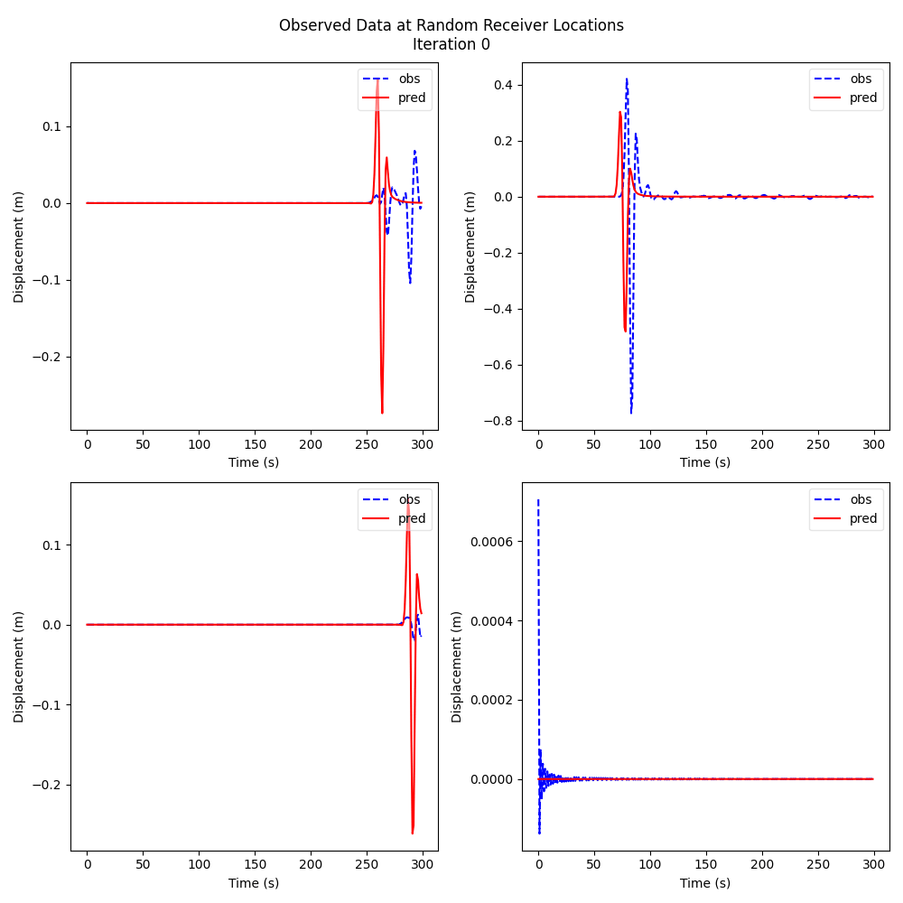

12
==

.. toctree::
   :maxdepth: 4
   :caption: Contents:

Metadata
--------

.. admonition:: Metadata
  :class: toggle

  .. admonition:: score
    :class: toggle

    .. admonition:: vp_compare.yaml
      :class: toggle

      .. code-block:: yaml

        human_timestamp: June 11, 2024 01:16:16 AM
        l2_diff: 64.95635986328125
        max_iters: 100
        name: Earth Mover's Distance
        orig_root: /home/tyler/Documents/repos/IslandOfMisfitToys/misfit_toys/hydra/multirun/HYDRA_TIME_2024-06-11/HYDRA_TIME_01-16-16/marmousi/deepwave_example/shots16/10/
        proj_path: marmousi/deepwave_example/shots16
        root: ../../misfit_toys/hydra/multirun/HYDRA_TIME_2024-06-11/HYDRA_TIME_01-16-16/marmousi/deepwave_example/shots16/10
        timestamp: 2024-06-11 01-16-16
        train_time: 486.44294834136963

  .. admonition:: hyperparameters
    :class: toggle

    .. admonition:: config.yaml
      :class: toggle

      .. code-block:: yaml

        case:
          port: 12576
          dupe: true
          editor: null
          name: Earth Mover's Distance
          np: self.runtime.prop.module.meta.nt
          data:
            prefix: conda/data
            proj_path: marmousi/deepwave_example/shots16
            path: ${.prefix}/${.proj_path}
            preprocess:
              dep: ^^null|misfit_toys.fwi.seismic_data|null
              minv: 1000
              maxv: 2500
              time_pad_frac: 0.2
              path_builder_kw:
                remap:
                  vp_init: vp
                vp_init:
                  runtime_func: self.data.preprocess.dep.ParamConstrained.delay_init
                  kw:
                    minv: ${case.data.preprocess.minv}
                    maxv: ${case.data.preprocess.maxv}
                    requires_grad: true
                src_amp_y:
                  runtime_func: self.data.preprocess.dep.Param.delay_init
                  kw:
                    requires_grad: false
                obs_data: null
                src_loc_y: null
                rec_loc_y: null
              required_fields:
              - vp_init
              - src_amp_y
              - obs_data
              - src_loc_y
              - rec_loc_y
              - meta
              chunk_keys:
                tensors:
                - obs_data
                - src_loc_y
                - rec_loc_y
                params:
                - src_amp_y
            postprocess:
              __call__: ^^null|misfit_toys.beta.postprocess|vp_compare
              kw:
                proj_path: ${...proj_path}
                name: ${case.name}
                max_iters: ${case.train.max_iters}
          plt:
            vp:
              sub:
                shape:
                - 2
                - 2
                kw:
                  figsize:
                  - 10
                  - 10
                adjust:
                  hspace: 0.5
                  wspace: 0.5
              iter:
                none_dims:
                - -2
                - -1
              save:
                path: figs/vp.gif
                movie_format: gif
                duration: 250
              order:
              - vp
              - vp_true
              - rel_diff
              plts:
                vp:
                  main:
                    filt: 'eval(lambda x : x.T)'
                    opts:
                      cmap: seismic
                      aspect: auto
                    title: $v_p$
                    type: imshow
                    xlabel: Rec Location (m)
                    ylabel: Depth (m)
                    colorbar: true
                rel_diff:
                  main:
                    filt: transpose
                    opts:
                      cmap: seismic
                      aspect: auto
                    title: Relative Difference (%)
                    type: imshow
                    xlabel: Rec Location (m)
                    ylabel: Depth (m)
                    colorbar: true
                vp_true:
                  main:
                    filt: transpose
                    opts:
                      cmap: seismic
                      aspect: auto
                    title: $v_{true}$
                    type: imshow
                    xlabel: Rec Location (m)
                    ylabel: Depth (m)
                    colorbar: true
            trace:
              sub:
                shape:
                - 2
                - 2
                kw:
                  figsize:
                  - 10
                  - 10
              iter:
                none_dims:
                - 0
                - -1
              save:
                path: figs/random_traces.gif
                duration: 250
              xlabel: Time (s)
              ylabel: Displacement (m)
              title: Observed Data at Receiver Location
              color_seq:
              - red
              - blue
              linestyles:
              - solid
              - dashed
              legend:
                loc: upper right
                framealpha: 0.5
              suptitle: Observed Data at Random Receiver Locations
          train:
            retrain: true
            max_iters: 100
            loss:
              runtime_func: ^^null|misfit_toys.beta.w1|working_w1
              kw:
                obs_data: self.runtime.data.obs_data
                model_params: self.runtime.prop.module.vp
                weights:
                - 1.0
                - 0.53
                reg_min: 0.0
                t: self.runtime.t
                max_calls: ${...max_iters}
                scale: 1.0
            optimizer:
              runtime_func: 'eval(lambda *args, **kw: [torch.optim.LBFGS, kw])'
              args: []
              kw:
                lr: 1.0
                max_iter: 20
                max_eval: null
                tolerance_grad: 1.0e-07
                tolerance_change: 1.0e-09
                history_size: 100
                line_search_fn: null
            stages:
              runtime_func: ^^null|misfit_toys.workflows.stages|vanilla_stages
              kw:
                max_iters: ${case.train.max_iters}
            step:
              runtime_func: ^^null|misfit_toys.beta.steps|direct
              kw:
                scale: 1000000.0
        run: w1_regularization_sweep

    .. admonition:: overrides.yaml
      :class: toggle

      .. code-block:: yaml

        - case=w1
        - case.train.max_iters=100
        - case.train.loss.kw.weights=[1.0,0.53]
        - +run=w1_regularization_sweep
        - case.editor=null

  .. admonition:: version control
    :class: toggle

    .. admonition:: git_info.txt
      :class: toggle

      .. code-block:: text

        HASH: b0a3f70816345e4b12a6b7237eda6d3689a00711
        BRANCH: devel
        
        UNTRACKED FILES: .latest_run
        .vscode/settings.json
        out/loss_record.pt
        out/loss_record_0.pt
        out/loss_record_1.pt
        out/out_record.pt
        out/out_record_0.pt
        out/out_record_1.pt
        out/vp_record.pt
        out/vp_record_0.pt
        out/vp_record_1.pt
        
        ********************************************************************************
        DIFF: diff --git a/misfit_toys/examples/hydra/cfg/case/train/loss/w1.yaml b/misfit_toys/examples/hydra/cfg/case/train/loss/w1.yaml
        index 6eba65d..4b04709 100644
        --- a/misfit_toys/examples/hydra/cfg/case/train/loss/w1.yaml
        +++ b/misfit_toys/examples/hydra/cfg/case/train/loss/w1.yaml
        @@ -8,4 +8,4 @@ kw:
           reg_min: 0.0
           t: self.runtime.t
           max_calls: ${...max_iters}
        -  scale: 1.0
        +  scale: 1.0
        \ No newline at end of file
        ********************************************************************************

  .. admonition:: stdout
    :class: toggle

    .. admonition:: main.log
      :class: toggle

      .. code-block:: text

        Empty file

    .. admonition:: rank_0.out
      :class: toggle

      .. code-block:: text

        Preprocessing took 0.00 seconds.
           Loading /home/tyler/anaconda3/envs/dw/data/marmousi/deepwave_example/shots16/vp_init.pt...torch.Size([600, 250])
           Loading /home/tyler/anaconda3/envs/dw/data/marmousi/deepwave_example/shots16/src_amp_y.pt...torch.Size([16, 1, 300])
           Loading /home/tyler/anaconda3/envs/dw/data/marmousi/deepwave_example/shots16/obs_data.pt...torch.Size([16, 100, 300])
           Loading /home/tyler/anaconda3/envs/dw/data/marmousi/deepwave_example/shots16/src_loc_y.pt...torch.Size([16, 1, 2])
           Loading /home/tyler/anaconda3/envs/dw/data/marmousi/deepwave_example/shots16/rec_loc_y.pt...torch.Size([16, 100, 2])
        Preprocess time rank 0: 0.40 seconds.
        rank: 0, iter: 1, loss: 3.52e+05, training.loss: 3.52e+05, lr: 1.000e+00, obs_data.norm: 4.05e+01, out.norm: 4.02e+01, rank: 0
        rank: 0, iter: 2, loss: 1.53e+05, training.loss: 1.53e+05, lr: 1.000e+00, obs_data.norm: 4.05e+01, out.norm: 4.01e+01, rank: 0
        rank: 0, iter: 3, loss: 7.87e+04, training.loss: 7.87e+04, lr: 1.000e+00, obs_data.norm: 4.05e+01, out.norm: 4.05e+01, rank: 0
        rank: 0, iter: 4, loss: 2.79e+04, training.loss: 2.79e+04, lr: 1.000e+00, obs_data.norm: 4.05e+01, out.norm: 4.05e+01, rank: 0
        rank: 0, iter: 5, loss: 5.85e+03, training.loss: 5.85e+03, lr: 1.000e+00, obs_data.norm: 4.05e+01, out.norm: 4.04e+01, rank: 0
        rank: 0, iter: 6, loss: 1.75e+02, training.loss: 1.75e+02, lr: 1.000e+00, obs_data.norm: 4.05e+01, out.norm: 4.07e+01, rank: 0
        rank: 0, iter: 7, loss: 1.24e+02, training.loss: 1.24e+02, lr: 1.000e+00, obs_data.norm: 4.05e+01, out.norm: 3.90e+01, rank: 0
        rank: 0, iter: 8, loss: 1.13e+02, training.loss: 1.13e+02, lr: 1.000e+00, obs_data.norm: 4.05e+01, out.norm: 3.93e+01, rank: 0
        rank: 0, iter: 9, loss: 1.09e+02, training.loss: 1.09e+02, lr: 1.000e+00, obs_data.norm: 4.05e+01, out.norm: 3.95e+01, rank: 0
        rank: 0, iter: 10, loss: 1.06e+02, training.loss: 1.06e+02, lr: 1.000e+00, obs_data.norm: 4.05e+01, out.norm: 3.96e+01, rank: 0
        rank: 0, iter: 11, loss: 1.05e+02, training.loss: 1.05e+02, lr: 1.000e+00, obs_data.norm: 4.05e+01, out.norm: 3.97e+01, rank: 0
        rank: 0, iter: 12, loss: 1.02e+02, training.loss: 1.02e+02, lr: 1.000e+00, obs_data.norm: 4.05e+01, out.norm: 3.97e+01, rank: 0
        rank: 0, iter: 13, loss: 9.94e+01, training.loss: 9.94e+01, lr: 1.000e+00, obs_data.norm: 4.05e+01, out.norm: 3.98e+01, rank: 0
        rank: 0, iter: 14, loss: 9.81e+01, training.loss: 9.81e+01, lr: 1.000e+00, obs_data.norm: 4.05e+01, out.norm: 3.98e+01, rank: 0
        rank: 0, iter: 15, loss: 9.73e+01, training.loss: 9.73e+01, lr: 1.000e+00, obs_data.norm: 4.05e+01, out.norm: 3.99e+01, rank: 0
        rank: 0, iter: 16, loss: 9.63e+01, training.loss: 9.63e+01, lr: 1.000e+00, obs_data.norm: 4.05e+01, out.norm: 3.99e+01, rank: 0
        rank: 0, iter: 17, loss: 9.54e+01, training.loss: 9.54e+01, lr: 1.000e+00, obs_data.norm: 4.05e+01, out.norm: 3.99e+01, rank: 0
        rank: 0, iter: 18, loss: 9.42e+01, training.loss: 9.42e+01, lr: 1.000e+00, obs_data.norm: 4.05e+01, out.norm: 4.00e+01, rank: 0
        rank: 0, iter: 19, loss: 9.30e+01, training.loss: 9.30e+01, lr: 1.000e+00, obs_data.norm: 4.05e+01, out.norm: 4.00e+01, rank: 0
        rank: 0, iter: 20, loss: 9.01e+01, training.loss: 9.01e+01, lr: 1.000e+00, obs_data.norm: 4.05e+01, out.norm: 4.00e+01, rank: 0
        rank: 0, iter: 21, loss: 8.39e+01, training.loss: 8.39e+01, lr: 1.000e+00, obs_data.norm: 4.05e+01, out.norm: 4.00e+01, rank: 0
        rank: 0, iter: 22, loss: 8.10e+01, training.loss: 8.10e+01, lr: 1.000e+00, obs_data.norm: 4.05e+01, out.norm: 4.00e+01, rank: 0
        rank: 0, iter: 23, loss: 7.97e+01, training.loss: 7.97e+01, lr: 1.000e+00, obs_data.norm: 4.05e+01, out.norm: 4.00e+01, rank: 0
        rank: 0, iter: 24, loss: 7.89e+01, training.loss: 7.89e+01, lr: 1.000e+00, obs_data.norm: 4.05e+01, out.norm: 4.00e+01, rank: 0
        rank: 0, iter: 25, loss: 7.82e+01, training.loss: 7.82e+01, lr: 1.000e+00, obs_data.norm: 4.05e+01, out.norm: 4.00e+01, rank: 0
        rank: 0, iter: 26, loss: 7.76e+01, training.loss: 7.76e+01, lr: 1.000e+00, obs_data.norm: 4.05e+01, out.norm: 4.01e+01, rank: 0
        rank: 0, iter: 27, loss: 7.68e+01, training.loss: 7.68e+01, lr: 1.000e+00, obs_data.norm: 4.05e+01, out.norm: 4.00e+01, rank: 0
        rank: 0, iter: 28, loss: 7.57e+01, training.loss: 7.57e+01, lr: 1.000e+00, obs_data.norm: 4.05e+01, out.norm: 4.00e+01, rank: 0
        rank: 0, iter: 29, loss: 7.37e+01, training.loss: 7.37e+01, lr: 1.000e+00, obs_data.norm: 4.05e+01, out.norm: 4.00e+01, rank: 0
        rank: 0, iter: 30, loss: 7.10e+01, training.loss: 7.10e+01, lr: 1.000e+00, obs_data.norm: 4.05e+01, out.norm: 3.99e+01, rank: 0
        rank: 0, iter: 31, loss: 6.59e+01, training.loss: 6.59e+01, lr: 1.000e+00, obs_data.norm: 4.05e+01, out.norm: 4.00e+01, rank: 0
        rank: 0, iter: 32, loss: 6.13e+01, training.loss: 6.13e+01, lr: 1.000e+00, obs_data.norm: 4.05e+01, out.norm: 4.00e+01, rank: 0
        rank: 0, iter: 33, loss: 5.88e+01, training.loss: 5.88e+01, lr: 1.000e+00, obs_data.norm: 4.05e+01, out.norm: 4.00e+01, rank: 0
        rank: 0, iter: 34, loss: 5.71e+01, training.loss: 5.71e+01, lr: 1.000e+00, obs_data.norm: 4.05e+01, out.norm: 4.00e+01, rank: 0
        rank: 0, iter: 35, loss: 5.54e+01, training.loss: 5.54e+01, lr: 1.000e+00, obs_data.norm: 4.05e+01, out.norm: 4.01e+01, rank: 0
        rank: 0, iter: 36, loss: 5.45e+01, training.loss: 5.45e+01, lr: 1.000e+00, obs_data.norm: 4.05e+01, out.norm: 4.01e+01, rank: 0
        rank: 0, iter: 37, loss: 5.35e+01, training.loss: 5.35e+01, lr: 1.000e+00, obs_data.norm: 4.05e+01, out.norm: 4.01e+01, rank: 0
        rank: 0, iter: 38, loss: 5.29e+01, training.loss: 5.29e+01, lr: 1.000e+00, obs_data.norm: 4.05e+01, out.norm: 4.01e+01, rank: 0
        rank: 0, iter: 39, loss: 5.23e+01, training.loss: 5.23e+01, lr: 1.000e+00, obs_data.norm: 4.05e+01, out.norm: 4.01e+01, rank: 0
        rank: 0, iter: 40, loss: 5.17e+01, training.loss: 5.17e+01, lr: 1.000e+00, obs_data.norm: 4.05e+01, out.norm: 4.01e+01, rank: 0
        rank: 0, iter: 41, loss: 5.12e+01, training.loss: 5.12e+01, lr: 1.000e+00, obs_data.norm: 4.05e+01, out.norm: 4.01e+01, rank: 0
        rank: 0, iter: 42, loss: 5.07e+01, training.loss: 5.07e+01, lr: 1.000e+00, obs_data.norm: 4.05e+01, out.norm: 4.02e+01, rank: 0
        rank: 0, iter: 43, loss: 5.03e+01, training.loss: 5.03e+01, lr: 1.000e+00, obs_data.norm: 4.05e+01, out.norm: 4.02e+01, rank: 0
        rank: 0, iter: 44, loss: 5.00e+01, training.loss: 5.00e+01, lr: 1.000e+00, obs_data.norm: 4.05e+01, out.norm: 4.02e+01, rank: 0
        rank: 0, iter: 45, loss: 4.97e+01, training.loss: 4.97e+01, lr: 1.000e+00, obs_data.norm: 4.05e+01, out.norm: 4.02e+01, rank: 0
        rank: 0, iter: 46, loss: 4.94e+01, training.loss: 4.94e+01, lr: 1.000e+00, obs_data.norm: 4.05e+01, out.norm: 4.01e+01, rank: 0
        rank: 0, iter: 47, loss: 4.91e+01, training.loss: 4.91e+01, lr: 1.000e+00, obs_data.norm: 4.05e+01, out.norm: 4.01e+01, rank: 0
        rank: 0, iter: 48, loss: 4.88e+01, training.loss: 4.88e+01, lr: 1.000e+00, obs_data.norm: 4.05e+01, out.norm: 4.01e+01, rank: 0
        rank: 0, iter: 49, loss: 4.82e+01, training.loss: 4.82e+01, lr: 1.000e+00, obs_data.norm: 4.05e+01, out.norm: 4.01e+01, rank: 0
        rank: 0, iter: 50, loss: 4.74e+01, training.loss: 4.74e+01, lr: 1.000e+00, obs_data.norm: 4.05e+01, out.norm: 4.01e+01, rank: 0
        rank: 0, iter: 51, loss: 4.69e+01, training.loss: 4.69e+01, lr: 1.000e+00, obs_data.norm: 4.05e+01, out.norm: 4.01e+01, rank: 0
        rank: 0, iter: 52, loss: 4.64e+01, training.loss: 4.64e+01, lr: 1.000e+00, obs_data.norm: 4.05e+01, out.norm: 4.01e+01, rank: 0
        rank: 0, iter: 53, loss: 4.61e+01, training.loss: 4.61e+01, lr: 1.000e+00, obs_data.norm: 4.05e+01, out.norm: 4.01e+01, rank: 0
        rank: 0, iter: 54, loss: 4.58e+01, training.loss: 4.58e+01, lr: 1.000e+00, obs_data.norm: 4.05e+01, out.norm: 4.01e+01, rank: 0
        rank: 0, iter: 55, loss: 4.55e+01, training.loss: 4.55e+01, lr: 1.000e+00, obs_data.norm: 4.05e+01, out.norm: 4.01e+01, rank: 0
        rank: 0, iter: 56, loss: 4.51e+01, training.loss: 4.51e+01, lr: 1.000e+00, obs_data.norm: 4.05e+01, out.norm: 4.01e+01, rank: 0
        rank: 0, iter: 57, loss: 4.49e+01, training.loss: 4.49e+01, lr: 1.000e+00, obs_data.norm: 4.05e+01, out.norm: 4.01e+01, rank: 0
        rank: 0, iter: 58, loss: 4.46e+01, training.loss: 4.46e+01, lr: 1.000e+00, obs_data.norm: 4.05e+01, out.norm: 4.01e+01, rank: 0
        rank: 0, iter: 59, loss: 4.44e+01, training.loss: 4.44e+01, lr: 1.000e+00, obs_data.norm: 4.05e+01, out.norm: 4.01e+01, rank: 0
        rank: 0, iter: 60, loss: 4.41e+01, training.loss: 4.41e+01, lr: 1.000e+00, obs_data.norm: 4.05e+01, out.norm: 4.01e+01, rank: 0
        rank: 0, iter: 61, loss: 4.38e+01, training.loss: 4.38e+01, lr: 1.000e+00, obs_data.norm: 4.05e+01, out.norm: 4.01e+01, rank: 0
        rank: 0, iter: 62, loss: 4.37e+01, training.loss: 4.37e+01, lr: 1.000e+00, obs_data.norm: 4.05e+01, out.norm: 4.01e+01, rank: 0
        rank: 0, iter: 63, loss: 4.34e+01, training.loss: 4.34e+01, lr: 1.000e+00, obs_data.norm: 4.05e+01, out.norm: 4.01e+01, rank: 0
        rank: 0, iter: 64, loss: 4.32e+01, training.loss: 4.32e+01, lr: 1.000e+00, obs_data.norm: 4.05e+01, out.norm: 4.01e+01, rank: 0
        rank: 0, iter: 65, loss: 4.31e+01, training.loss: 4.31e+01, lr: 1.000e+00, obs_data.norm: 4.05e+01, out.norm: 4.02e+01, rank: 0
        rank: 0, iter: 66, loss: 4.29e+01, training.loss: 4.29e+01, lr: 1.000e+00, obs_data.norm: 4.05e+01, out.norm: 4.02e+01, rank: 0
        rank: 0, iter: 67, loss: 4.28e+01, training.loss: 4.28e+01, lr: 1.000e+00, obs_data.norm: 4.05e+01, out.norm: 4.02e+01, rank: 0
        rank: 0, iter: 68, loss: 4.26e+01, training.loss: 4.26e+01, lr: 1.000e+00, obs_data.norm: 4.05e+01, out.norm: 4.02e+01, rank: 0
        rank: 0, iter: 69, loss: 4.24e+01, training.loss: 4.24e+01, lr: 1.000e+00, obs_data.norm: 4.05e+01, out.norm: 4.02e+01, rank: 0
        rank: 0, iter: 70, loss: 4.23e+01, training.loss: 4.23e+01, lr: 1.000e+00, obs_data.norm: 4.05e+01, out.norm: 4.02e+01, rank: 0
        rank: 0, iter: 71, loss: 4.22e+01, training.loss: 4.22e+01, lr: 1.000e+00, obs_data.norm: 4.05e+01, out.norm: 4.02e+01, rank: 0
        rank: 0, iter: 72, loss: 4.20e+01, training.loss: 4.20e+01, lr: 1.000e+00, obs_data.norm: 4.05e+01, out.norm: 4.02e+01, rank: 0
        rank: 0, iter: 73, loss: 4.19e+01, training.loss: 4.19e+01, lr: 1.000e+00, obs_data.norm: 4.05e+01, out.norm: 4.02e+01, rank: 0
        rank: 0, iter: 74, loss: 4.18e+01, training.loss: 4.18e+01, lr: 1.000e+00, obs_data.norm: 4.05e+01, out.norm: 4.02e+01, rank: 0
        rank: 0, iter: 75, loss: 4.16e+01, training.loss: 4.16e+01, lr: 1.000e+00, obs_data.norm: 4.05e+01, out.norm: 4.02e+01, rank: 0
        rank: 0, iter: 76, loss: 4.15e+01, training.loss: 4.15e+01, lr: 1.000e+00, obs_data.norm: 4.05e+01, out.norm: 4.02e+01, rank: 0
        rank: 0, iter: 77, loss: 4.14e+01, training.loss: 4.14e+01, lr: 1.000e+00, obs_data.norm: 4.05e+01, out.norm: 4.02e+01, rank: 0
        rank: 0, iter: 78, loss: 4.13e+01, training.loss: 4.13e+01, lr: 1.000e+00, obs_data.norm: 4.05e+01, out.norm: 4.02e+01, rank: 0
        rank: 0, iter: 79, loss: 4.12e+01, training.loss: 4.12e+01, lr: 1.000e+00, obs_data.norm: 4.05e+01, out.norm: 4.02e+01, rank: 0
        rank: 0, iter: 80, loss: 4.11e+01, training.loss: 4.11e+01, lr: 1.000e+00, obs_data.norm: 4.05e+01, out.norm: 4.02e+01, rank: 0
        rank: 0, iter: 81, loss: 4.10e+01, training.loss: 4.10e+01, lr: 1.000e+00, obs_data.norm: 4.05e+01, out.norm: 4.02e+01, rank: 0
        rank: 0, iter: 82, loss: 4.09e+01, training.loss: 4.09e+01, lr: 1.000e+00, obs_data.norm: 4.05e+01, out.norm: 4.02e+01, rank: 0
        rank: 0, iter: 83, loss: 4.07e+01, training.loss: 4.07e+01, lr: 1.000e+00, obs_data.norm: 4.05e+01, out.norm: 4.02e+01, rank: 0
        rank: 0, iter: 84, loss: 4.06e+01, training.loss: 4.06e+01, lr: 1.000e+00, obs_data.norm: 4.05e+01, out.norm: 4.02e+01, rank: 0
        rank: 0, iter: 85, loss: 4.05e+01, training.loss: 4.05e+01, lr: 1.000e+00, obs_data.norm: 4.05e+01, out.norm: 4.02e+01, rank: 0
        rank: 0, iter: 86, loss: 4.04e+01, training.loss: 4.04e+01, lr: 1.000e+00, obs_data.norm: 4.05e+01, out.norm: 4.02e+01, rank: 0
        rank: 0, iter: 87, loss: 4.03e+01, training.loss: 4.03e+01, lr: 1.000e+00, obs_data.norm: 4.05e+01, out.norm: 4.02e+01, rank: 0
        rank: 0, iter: 88, loss: 4.02e+01, training.loss: 4.02e+01, lr: 1.000e+00, obs_data.norm: 4.05e+01, out.norm: 4.02e+01, rank: 0
        rank: 0, iter: 89, loss: 4.01e+01, training.loss: 4.01e+01, lr: 1.000e+00, obs_data.norm: 4.05e+01, out.norm: 4.02e+01, rank: 0
        rank: 0, iter: 90, loss: 4.00e+01, training.loss: 4.00e+01, lr: 1.000e+00, obs_data.norm: 4.05e+01, out.norm: 4.02e+01, rank: 0
        rank: 0, iter: 91, loss: 3.99e+01, training.loss: 3.99e+01, lr: 1.000e+00, obs_data.norm: 4.05e+01, out.norm: 4.02e+01, rank: 0
        rank: 0, iter: 92, loss: 3.99e+01, training.loss: 3.99e+01, lr: 1.000e+00, obs_data.norm: 4.05e+01, out.norm: 4.02e+01, rank: 0
        rank: 0, iter: 93, loss: 3.98e+01, training.loss: 3.98e+01, lr: 1.000e+00, obs_data.norm: 4.05e+01, out.norm: 4.02e+01, rank: 0
        rank: 0, iter: 94, loss: 3.97e+01, training.loss: 3.97e+01, lr: 1.000e+00, obs_data.norm: 4.05e+01, out.norm: 4.02e+01, rank: 0
        rank: 0, iter: 95, loss: 3.96e+01, training.loss: 3.96e+01, lr: 1.000e+00, obs_data.norm: 4.05e+01, out.norm: 4.02e+01, rank: 0
        rank: 0, iter: 96, loss: 3.96e+01, training.loss: 3.96e+01, lr: 1.000e+00, obs_data.norm: 4.05e+01, out.norm: 4.02e+01, rank: 0
        rank: 0, iter: 97, loss: 3.95e+01, training.loss: 3.95e+01, lr: 1.000e+00, obs_data.norm: 4.05e+01, out.norm: 4.02e+01, rank: 0
        rank: 0, iter: 98, loss: 3.94e+01, training.loss: 3.94e+01, lr: 1.000e+00, obs_data.norm: 4.05e+01, out.norm: 4.02e+01, rank: 0
        rank: 0, iter: 99, loss: 3.94e+01, training.loss: 3.94e+01, lr: 1.000e+00, obs_data.norm: 4.05e+01, out.norm: 4.02e+01, rank: 0
        rank: 0, iter: 100, loss: 3.93e+01, training.loss: 3.93e+01, lr: 1.000e+00, obs_data.norm: 4.05e+01, out.norm: 4.02e+01, rank: 0
        Presaving loss
        Presaving vp
        Presaving out
        Train time rank 0: 482.06 seconds.

    .. admonition:: rank_1.out
      :class: toggle

      .. code-block:: text

        Preprocessing took 0.00 seconds.
           Loading /home/tyler/anaconda3/envs/dw/data/marmousi/deepwave_example/shots16/vp_init.pt...torch.Size([600, 250])
           Loading /home/tyler/anaconda3/envs/dw/data/marmousi/deepwave_example/shots16/src_amp_y.pt...torch.Size([16, 1, 300])
           Loading /home/tyler/anaconda3/envs/dw/data/marmousi/deepwave_example/shots16/obs_data.pt...torch.Size([16, 100, 300])
           Loading /home/tyler/anaconda3/envs/dw/data/marmousi/deepwave_example/shots16/src_loc_y.pt...torch.Size([16, 1, 2])
           Loading /home/tyler/anaconda3/envs/dw/data/marmousi/deepwave_example/shots16/rec_loc_y.pt...torch.Size([16, 100, 2])
        Preprocess time rank 1: 0.29 seconds.
        rank: 1, iter: 1, loss: 3.52e+05, training.loss: 3.52e+05, lr: 1.000e+00, obs_data.norm: 4.18e+01, out.norm: 4.01e+01, rank: 1
        rank: 1, iter: 2, loss: 1.53e+05, training.loss: 1.53e+05, lr: 1.000e+00, obs_data.norm: 4.18e+01, out.norm: 4.01e+01, rank: 1
        rank: 1, iter: 3, loss: 7.88e+04, training.loss: 7.88e+04, lr: 1.000e+00, obs_data.norm: 4.18e+01, out.norm: 4.04e+01, rank: 1
        rank: 1, iter: 4, loss: 2.79e+04, training.loss: 2.79e+04, lr: 1.000e+00, obs_data.norm: 4.18e+01, out.norm: 4.04e+01, rank: 1
        rank: 1, iter: 5, loss: 5.87e+03, training.loss: 5.87e+03, lr: 1.000e+00, obs_data.norm: 4.18e+01, out.norm: 4.04e+01, rank: 1
        rank: 1, iter: 6, loss: 1.97e+02, training.loss: 1.97e+02, lr: 1.000e+00, obs_data.norm: 4.18e+01, out.norm: 4.06e+01, rank: 1
        rank: 1, iter: 7, loss: 1.59e+02, training.loss: 1.59e+02, lr: 1.000e+00, obs_data.norm: 4.18e+01, out.norm: 3.84e+01, rank: 1
        rank: 1, iter: 8, loss: 1.40e+02, training.loss: 1.40e+02, lr: 1.000e+00, obs_data.norm: 4.18e+01, out.norm: 3.94e+01, rank: 1
        rank: 1, iter: 9, loss: 1.32e+02, training.loss: 1.32e+02, lr: 1.000e+00, obs_data.norm: 4.18e+01, out.norm: 3.97e+01, rank: 1
        rank: 1, iter: 10, loss: 1.29e+02, training.loss: 1.29e+02, lr: 1.000e+00, obs_data.norm: 4.18e+01, out.norm: 3.99e+01, rank: 1
        rank: 1, iter: 11, loss: 1.26e+02, training.loss: 1.26e+02, lr: 1.000e+00, obs_data.norm: 4.18e+01, out.norm: 4.02e+01, rank: 1
        rank: 1, iter: 12, loss: 1.23e+02, training.loss: 1.23e+02, lr: 1.000e+00, obs_data.norm: 4.18e+01, out.norm: 4.03e+01, rank: 1
        rank: 1, iter: 13, loss: 1.21e+02, training.loss: 1.21e+02, lr: 1.000e+00, obs_data.norm: 4.18e+01, out.norm: 4.04e+01, rank: 1
        rank: 1, iter: 14, loss: 1.20e+02, training.loss: 1.20e+02, lr: 1.000e+00, obs_data.norm: 4.18e+01, out.norm: 4.04e+01, rank: 1
        rank: 1, iter: 15, loss: 1.19e+02, training.loss: 1.19e+02, lr: 1.000e+00, obs_data.norm: 4.18e+01, out.norm: 4.05e+01, rank: 1
        rank: 1, iter: 16, loss: 1.19e+02, training.loss: 1.19e+02, lr: 1.000e+00, obs_data.norm: 4.18e+01, out.norm: 4.05e+01, rank: 1
        rank: 1, iter: 17, loss: 1.18e+02, training.loss: 1.18e+02, lr: 1.000e+00, obs_data.norm: 4.18e+01, out.norm: 4.06e+01, rank: 1
        rank: 1, iter: 18, loss: 1.17e+02, training.loss: 1.17e+02, lr: 1.000e+00, obs_data.norm: 4.18e+01, out.norm: 4.07e+01, rank: 1
        rank: 1, iter: 19, loss: 1.17e+02, training.loss: 1.17e+02, lr: 1.000e+00, obs_data.norm: 4.18e+01, out.norm: 4.07e+01, rank: 1
        rank: 1, iter: 20, loss: 1.17e+02, training.loss: 1.17e+02, lr: 1.000e+00, obs_data.norm: 4.18e+01, out.norm: 4.08e+01, rank: 1
        rank: 1, iter: 21, loss: 1.16e+02, training.loss: 1.16e+02, lr: 1.000e+00, obs_data.norm: 4.18e+01, out.norm: 4.07e+01, rank: 1
        rank: 1, iter: 22, loss: 1.16e+02, training.loss: 1.16e+02, lr: 1.000e+00, obs_data.norm: 4.18e+01, out.norm: 4.08e+01, rank: 1
        rank: 1, iter: 23, loss: 1.15e+02, training.loss: 1.15e+02, lr: 1.000e+00, obs_data.norm: 4.18e+01, out.norm: 4.08e+01, rank: 1
        rank: 1, iter: 24, loss: 1.14e+02, training.loss: 1.14e+02, lr: 1.000e+00, obs_data.norm: 4.18e+01, out.norm: 4.08e+01, rank: 1
        rank: 1, iter: 25, loss: 1.14e+02, training.loss: 1.14e+02, lr: 1.000e+00, obs_data.norm: 4.18e+01, out.norm: 4.08e+01, rank: 1
        rank: 1, iter: 26, loss: 1.14e+02, training.loss: 1.14e+02, lr: 1.000e+00, obs_data.norm: 4.18e+01, out.norm: 4.08e+01, rank: 1
        rank: 1, iter: 27, loss: 1.13e+02, training.loss: 1.13e+02, lr: 1.000e+00, obs_data.norm: 4.18e+01, out.norm: 4.09e+01, rank: 1
        rank: 1, iter: 28, loss: 1.13e+02, training.loss: 1.13e+02, lr: 1.000e+00, obs_data.norm: 4.18e+01, out.norm: 4.09e+01, rank: 1
        rank: 1, iter: 29, loss: 1.12e+02, training.loss: 1.12e+02, lr: 1.000e+00, obs_data.norm: 4.18e+01, out.norm: 4.08e+01, rank: 1
        rank: 1, iter: 30, loss: 1.08e+02, training.loss: 1.08e+02, lr: 1.000e+00, obs_data.norm: 4.18e+01, out.norm: 4.08e+01, rank: 1
        rank: 1, iter: 31, loss: 1.00e+02, training.loss: 1.00e+02, lr: 1.000e+00, obs_data.norm: 4.18e+01, out.norm: 4.07e+01, rank: 1
        rank: 1, iter: 32, loss: 8.80e+01, training.loss: 8.80e+01, lr: 1.000e+00, obs_data.norm: 4.18e+01, out.norm: 4.07e+01, rank: 1
        rank: 1, iter: 33, loss: 8.31e+01, training.loss: 8.31e+01, lr: 1.000e+00, obs_data.norm: 4.18e+01, out.norm: 4.07e+01, rank: 1
        rank: 1, iter: 34, loss: 7.97e+01, training.loss: 7.97e+01, lr: 1.000e+00, obs_data.norm: 4.18e+01, out.norm: 4.07e+01, rank: 1
        rank: 1, iter: 35, loss: 7.78e+01, training.loss: 7.78e+01, lr: 1.000e+00, obs_data.norm: 4.18e+01, out.norm: 4.07e+01, rank: 1
        rank: 1, iter: 36, loss: 7.61e+01, training.loss: 7.61e+01, lr: 1.000e+00, obs_data.norm: 4.18e+01, out.norm: 4.07e+01, rank: 1
        rank: 1, iter: 37, loss: 7.47e+01, training.loss: 7.47e+01, lr: 1.000e+00, obs_data.norm: 4.18e+01, out.norm: 4.07e+01, rank: 1
        rank: 1, iter: 38, loss: 7.35e+01, training.loss: 7.35e+01, lr: 1.000e+00, obs_data.norm: 4.18e+01, out.norm: 4.07e+01, rank: 1
        rank: 1, iter: 39, loss: 7.25e+01, training.loss: 7.25e+01, lr: 1.000e+00, obs_data.norm: 4.18e+01, out.norm: 4.08e+01, rank: 1
        rank: 1, iter: 40, loss: 7.17e+01, training.loss: 7.17e+01, lr: 1.000e+00, obs_data.norm: 4.18e+01, out.norm: 4.08e+01, rank: 1
        rank: 1, iter: 41, loss: 7.09e+01, training.loss: 7.09e+01, lr: 1.000e+00, obs_data.norm: 4.18e+01, out.norm: 4.08e+01, rank: 1
        rank: 1, iter: 42, loss: 7.04e+01, training.loss: 7.04e+01, lr: 1.000e+00, obs_data.norm: 4.18e+01, out.norm: 4.08e+01, rank: 1
        rank: 1, iter: 43, loss: 6.97e+01, training.loss: 6.97e+01, lr: 1.000e+00, obs_data.norm: 4.18e+01, out.norm: 4.08e+01, rank: 1
        rank: 1, iter: 44, loss: 6.92e+01, training.loss: 6.92e+01, lr: 1.000e+00, obs_data.norm: 4.18e+01, out.norm: 4.08e+01, rank: 1
        rank: 1, iter: 45, loss: 6.88e+01, training.loss: 6.88e+01, lr: 1.000e+00, obs_data.norm: 4.18e+01, out.norm: 4.08e+01, rank: 1
        rank: 1, iter: 46, loss: 6.82e+01, training.loss: 6.82e+01, lr: 1.000e+00, obs_data.norm: 4.18e+01, out.norm: 4.08e+01, rank: 1
        rank: 1, iter: 47, loss: 6.77e+01, training.loss: 6.77e+01, lr: 1.000e+00, obs_data.norm: 4.18e+01, out.norm: 4.08e+01, rank: 1
        rank: 1, iter: 48, loss: 6.68e+01, training.loss: 6.68e+01, lr: 1.000e+00, obs_data.norm: 4.18e+01, out.norm: 4.08e+01, rank: 1
        rank: 1, iter: 49, loss: 6.58e+01, training.loss: 6.58e+01, lr: 1.000e+00, obs_data.norm: 4.18e+01, out.norm: 4.08e+01, rank: 1
        rank: 1, iter: 50, loss: 6.51e+01, training.loss: 6.51e+01, lr: 1.000e+00, obs_data.norm: 4.18e+01, out.norm: 4.09e+01, rank: 1
        rank: 1, iter: 51, loss: 6.45e+01, training.loss: 6.45e+01, lr: 1.000e+00, obs_data.norm: 4.18e+01, out.norm: 4.09e+01, rank: 1
        rank: 1, iter: 52, loss: 6.39e+01, training.loss: 6.39e+01, lr: 1.000e+00, obs_data.norm: 4.18e+01, out.norm: 4.09e+01, rank: 1
        rank: 1, iter: 53, loss: 6.35e+01, training.loss: 6.35e+01, lr: 1.000e+00, obs_data.norm: 4.18e+01, out.norm: 4.09e+01, rank: 1
        rank: 1, iter: 54, loss: 6.31e+01, training.loss: 6.31e+01, lr: 1.000e+00, obs_data.norm: 4.18e+01, out.norm: 4.10e+01, rank: 1
        rank: 1, iter: 55, loss: 6.27e+01, training.loss: 6.27e+01, lr: 1.000e+00, obs_data.norm: 4.18e+01, out.norm: 4.10e+01, rank: 1
        rank: 1, iter: 56, loss: 6.24e+01, training.loss: 6.24e+01, lr: 1.000e+00, obs_data.norm: 4.18e+01, out.norm: 4.10e+01, rank: 1
        rank: 1, iter: 57, loss: 6.21e+01, training.loss: 6.21e+01, lr: 1.000e+00, obs_data.norm: 4.18e+01, out.norm: 4.10e+01, rank: 1
        rank: 1, iter: 58, loss: 6.18e+01, training.loss: 6.18e+01, lr: 1.000e+00, obs_data.norm: 4.18e+01, out.norm: 4.10e+01, rank: 1
        rank: 1, iter: 59, loss: 6.14e+01, training.loss: 6.14e+01, lr: 1.000e+00, obs_data.norm: 4.18e+01, out.norm: 4.10e+01, rank: 1
        rank: 1, iter: 60, loss: 6.12e+01, training.loss: 6.12e+01, lr: 1.000e+00, obs_data.norm: 4.18e+01, out.norm: 4.10e+01, rank: 1
        rank: 1, iter: 61, loss: 6.07e+01, training.loss: 6.07e+01, lr: 1.000e+00, obs_data.norm: 4.18e+01, out.norm: 4.10e+01, rank: 1
        rank: 1, iter: 62, loss: 6.04e+01, training.loss: 6.04e+01, lr: 1.000e+00, obs_data.norm: 4.18e+01, out.norm: 4.10e+01, rank: 1
        rank: 1, iter: 63, loss: 6.01e+01, training.loss: 6.01e+01, lr: 1.000e+00, obs_data.norm: 4.18e+01, out.norm: 4.10e+01, rank: 1
        rank: 1, iter: 64, loss: 5.98e+01, training.loss: 5.98e+01, lr: 1.000e+00, obs_data.norm: 4.18e+01, out.norm: 4.10e+01, rank: 1
        rank: 1, iter: 65, loss: 5.96e+01, training.loss: 5.96e+01, lr: 1.000e+00, obs_data.norm: 4.18e+01, out.norm: 4.10e+01, rank: 1
        rank: 1, iter: 66, loss: 5.94e+01, training.loss: 5.94e+01, lr: 1.000e+00, obs_data.norm: 4.18e+01, out.norm: 4.10e+01, rank: 1
        rank: 1, iter: 67, loss: 5.91e+01, training.loss: 5.91e+01, lr: 1.000e+00, obs_data.norm: 4.18e+01, out.norm: 4.10e+01, rank: 1
        rank: 1, iter: 68, loss: 5.89e+01, training.loss: 5.89e+01, lr: 1.000e+00, obs_data.norm: 4.18e+01, out.norm: 4.11e+01, rank: 1
        rank: 1, iter: 69, loss: 5.87e+01, training.loss: 5.87e+01, lr: 1.000e+00, obs_data.norm: 4.18e+01, out.norm: 4.11e+01, rank: 1
        rank: 1, iter: 70, loss: 5.85e+01, training.loss: 5.85e+01, lr: 1.000e+00, obs_data.norm: 4.18e+01, out.norm: 4.11e+01, rank: 1
        rank: 1, iter: 71, loss: 5.83e+01, training.loss: 5.83e+01, lr: 1.000e+00, obs_data.norm: 4.18e+01, out.norm: 4.11e+01, rank: 1
        rank: 1, iter: 72, loss: 5.81e+01, training.loss: 5.81e+01, lr: 1.000e+00, obs_data.norm: 4.18e+01, out.norm: 4.11e+01, rank: 1
        rank: 1, iter: 73, loss: 5.80e+01, training.loss: 5.80e+01, lr: 1.000e+00, obs_data.norm: 4.18e+01, out.norm: 4.11e+01, rank: 1
        rank: 1, iter: 74, loss: 5.78e+01, training.loss: 5.78e+01, lr: 1.000e+00, obs_data.norm: 4.18e+01, out.norm: 4.11e+01, rank: 1
        rank: 1, iter: 75, loss: 5.76e+01, training.loss: 5.76e+01, lr: 1.000e+00, obs_data.norm: 4.18e+01, out.norm: 4.11e+01, rank: 1
        rank: 1, iter: 76, loss: 5.75e+01, training.loss: 5.75e+01, lr: 1.000e+00, obs_data.norm: 4.18e+01, out.norm: 4.11e+01, rank: 1
        rank: 1, iter: 77, loss: 5.74e+01, training.loss: 5.74e+01, lr: 1.000e+00, obs_data.norm: 4.18e+01, out.norm: 4.11e+01, rank: 1
        rank: 1, iter: 78, loss: 5.72e+01, training.loss: 5.72e+01, lr: 1.000e+00, obs_data.norm: 4.18e+01, out.norm: 4.11e+01, rank: 1
        rank: 1, iter: 79, loss: 5.71e+01, training.loss: 5.71e+01, lr: 1.000e+00, obs_data.norm: 4.18e+01, out.norm: 4.11e+01, rank: 1
        rank: 1, iter: 80, loss: 5.69e+01, training.loss: 5.69e+01, lr: 1.000e+00, obs_data.norm: 4.18e+01, out.norm: 4.11e+01, rank: 1
        rank: 1, iter: 81, loss: 5.68e+01, training.loss: 5.68e+01, lr: 1.000e+00, obs_data.norm: 4.18e+01, out.norm: 4.11e+01, rank: 1
        rank: 1, iter: 82, loss: 5.66e+01, training.loss: 5.66e+01, lr: 1.000e+00, obs_data.norm: 4.18e+01, out.norm: 4.11e+01, rank: 1
        rank: 1, iter: 83, loss: 5.65e+01, training.loss: 5.65e+01, lr: 1.000e+00, obs_data.norm: 4.18e+01, out.norm: 4.12e+01, rank: 1
        rank: 1, iter: 84, loss: 5.63e+01, training.loss: 5.63e+01, lr: 1.000e+00, obs_data.norm: 4.18e+01, out.norm: 4.11e+01, rank: 1
        rank: 1, iter: 85, loss: 5.62e+01, training.loss: 5.62e+01, lr: 1.000e+00, obs_data.norm: 4.18e+01, out.norm: 4.11e+01, rank: 1
        rank: 1, iter: 86, loss: 5.61e+01, training.loss: 5.61e+01, lr: 1.000e+00, obs_data.norm: 4.18e+01, out.norm: 4.12e+01, rank: 1
        rank: 1, iter: 87, loss: 5.60e+01, training.loss: 5.60e+01, lr: 1.000e+00, obs_data.norm: 4.18e+01, out.norm: 4.12e+01, rank: 1
        rank: 1, iter: 88, loss: 5.58e+01, training.loss: 5.58e+01, lr: 1.000e+00, obs_data.norm: 4.18e+01, out.norm: 4.12e+01, rank: 1
        rank: 1, iter: 89, loss: 5.57e+01, training.loss: 5.57e+01, lr: 1.000e+00, obs_data.norm: 4.18e+01, out.norm: 4.12e+01, rank: 1
        rank: 1, iter: 90, loss: 5.56e+01, training.loss: 5.56e+01, lr: 1.000e+00, obs_data.norm: 4.18e+01, out.norm: 4.12e+01, rank: 1
        rank: 1, iter: 91, loss: 5.55e+01, training.loss: 5.55e+01, lr: 1.000e+00, obs_data.norm: 4.18e+01, out.norm: 4.12e+01, rank: 1
        rank: 1, iter: 92, loss: 5.54e+01, training.loss: 5.54e+01, lr: 1.000e+00, obs_data.norm: 4.18e+01, out.norm: 4.12e+01, rank: 1
        rank: 1, iter: 93, loss: 5.53e+01, training.loss: 5.53e+01, lr: 1.000e+00, obs_data.norm: 4.18e+01, out.norm: 4.12e+01, rank: 1
        rank: 1, iter: 94, loss: 5.52e+01, training.loss: 5.52e+01, lr: 1.000e+00, obs_data.norm: 4.18e+01, out.norm: 4.12e+01, rank: 1
        rank: 1, iter: 95, loss: 5.51e+01, training.loss: 5.51e+01, lr: 1.000e+00, obs_data.norm: 4.18e+01, out.norm: 4.12e+01, rank: 1
        rank: 1, iter: 96, loss: 5.50e+01, training.loss: 5.50e+01, lr: 1.000e+00, obs_data.norm: 4.18e+01, out.norm: 4.12e+01, rank: 1
        rank: 1, iter: 97, loss: 5.49e+01, training.loss: 5.49e+01, lr: 1.000e+00, obs_data.norm: 4.18e+01, out.norm: 4.12e+01, rank: 1
        rank: 1, iter: 98, loss: 5.48e+01, training.loss: 5.48e+01, lr: 1.000e+00, obs_data.norm: 4.18e+01, out.norm: 4.12e+01, rank: 1
        rank: 1, iter: 99, loss: 5.47e+01, training.loss: 5.47e+01, lr: 1.000e+00, obs_data.norm: 4.18e+01, out.norm: 4.12e+01, rank: 1
        rank: 1, iter: 100, loss: 5.46e+01, training.loss: 5.46e+01, lr: 1.000e+00, obs_data.norm: 4.18e+01, out.norm: 4.12e+01, rank: 1
        Presaving loss
        Presaving vp
        Presaving out
        Train time rank 1: 482.06 seconds.

  .. admonition:: stderr
    :class: toggle

    .. admonition:: rank_0.err
      :class: toggle

      .. code-block:: text

        Empty file

    .. admonition:: rank_1.err
      :class: toggle

      .. code-block:: text

        Empty file

  .. admonition:: other
    :class: toggle

    .. admonition:: hydra.yaml
      :class: toggle

      .. code-block:: yaml

        hydra:
          run:
            dir: outputs/HYDRA_TIME_${now:%Y-%m-%d}/HYDRA_TIME_${now:%H-%M-%S}/${case.data.proj_path}
          sweep:
            dir: multirun/HYDRA_TIME_${now:%Y-%m-%d}/HYDRA_TIME_${now:%H-%M-%S}/${case.data.proj_path}
            subdir: ${hydra.job.num}
          launcher:
            _target_: hydra._internal.core_plugins.basic_launcher.BasicLauncher
          sweeper:
            _target_: hydra._internal.core_plugins.basic_sweeper.BasicSweeper
            max_batch_size: null
            params: null
          help:
            app_name: ${hydra.job.name}
            header: '${hydra.help.app_name} is powered by Hydra.
        
              '
            footer: 'Powered by Hydra (https://hydra.cc)
        
              Use --hydra-help to view Hydra specific help
        
              '
            template: '${hydra.help.header}
        
              == Configuration groups ==
        
              Compose your configuration from those groups (group=option)
        
        
              $APP_CONFIG_GROUPS
        
        
              == Config ==
        
              Override anything in the config (foo.bar=value)
        
        
              $CONFIG
        
        
              ${hydra.help.footer}
        
              '
          hydra_help:
            template: 'Hydra (${hydra.runtime.version})
        
              See https://hydra.cc for more info.
        
        
              == Flags ==
        
              $FLAGS_HELP
        
        
              == Configuration groups ==
        
              Compose your configuration from those groups (For example, append hydra/job_logging=disabled
              to command line)
        
        
              $HYDRA_CONFIG_GROUPS
        
        
              Use ''--cfg hydra'' to Show the Hydra config.
        
              '
            hydra_help: ???
          hydra_logging:
            version: 1
            formatters:
              simple:
                format: '[%(asctime)s][HYDRA] %(message)s'
            handlers:
              console:
                class: logging.StreamHandler
                formatter: simple
                stream: ext://sys.stdout
            root:
              level: INFO
              handlers:
              - console
            loggers:
              logging_example:
                level: DEBUG
            disable_existing_loggers: false
          job_logging:
            version: 1
            formatters:
              simple:
                format: '[%(asctime)s][%(name)s][%(levelname)s] - %(message)s'
            handlers:
              console:
                class: logging.StreamHandler
                formatter: simple
                stream: ext://sys.stdout
              file:
                class: logging.FileHandler
                formatter: simple
                filename: ${hydra.runtime.output_dir}/${hydra.job.name}.log
            root:
              level: INFO
              handlers:
              - console
              - file
            disable_existing_loggers: false
          env: {}
          mode: MULTIRUN
          searchpath: []
          callbacks: {}
          output_subdir: ''
          overrides:
            hydra:
            - hydra.mode=MULTIRUN
            task:
            - case=w1
            - case.train.max_iters=100
            - case.train.loss.kw.weights=[1.0,0.53]
            - +run=w1_regularization_sweep
            - case.editor=null
          job:
            name: main
            chdir: null
            override_dirname: +run=w1_regularization_sweep,case.editor=null,case.train.loss.kw.weights=[1.0,0.53],case.train.max_iters=100,case=w1
            id: '10'
            num: 10
            config_name: cfg
            env_set: {}
            env_copy: []
            config:
              override_dirname:
                kv_sep: '='
                item_sep: ','
                exclude_keys: []
          runtime:
            version: 1.3.2
            version_base: '1.3'
            cwd: /home/tyler/Documents/repos/IslandOfMisfitToys/misfit_toys/hydra
            config_sources:
            - path: hydra.conf
              schema: pkg
              provider: hydra
            - path: /home/tyler/Documents/repos/IslandOfMisfitToys/misfit_toys/hydra/cfg
              schema: file
              provider: main
            - path: ''
              schema: structured
              provider: schema
            output_dir: /home/tyler/Documents/repos/IslandOfMisfitToys/misfit_toys/hydra/multirun/HYDRA_TIME_2024-06-11/HYDRA_TIME_01-16-16/marmousi/deepwave_example/shots16/10
            choices:
              case: w1
              case/train/step: direct
              case/train/stages: vanilla
              case/train/optimizer: lbfgs
              case/train/loss: w1
              case/train: train
              case/plt: plt
              case/data/postprocess: simple
              case/data/preprocess: constrained_vel
              case/data: data
              hydra/env: default
              hydra/callbacks: null
              hydra/job_logging: default
              hydra/hydra_logging: default
              hydra/hydra_help: default
              hydra/help: default
              hydra/sweeper: basic
              hydra/launcher: basic
              hydra/output: default
          verbose: false

    .. admonition:: resolved_config.yaml
      :class: toggle

      .. code-block:: yaml

        case: 
          data: 
            path: conda/data/marmousi/deepwave_example/shots16
            postprocess: 
              __call__: ^^null|misfit_toys.beta.postprocess|vp_compare
              kw: 
                max_iters: 100
                name: Earth Mover's Distance
                proj_path: marmousi/deepwave_example/shots16
            prefix: conda/data
            preprocess: 
              chunk_keys: 
                params:
                - src_amp_y
                tensors:
                - obs_data
                - src_loc_y
                - rec_loc_y
              dep: ^^null|misfit_toys.fwi.seismic_data|null
              maxv: 2500
              minv: 1000
              path_builder_kw: 
                obs_data: null
                rec_loc_y: null
                remap: 
                  vp_init: vp
                src_amp_y: 
                  kw: 
                    requires_grad: false
                  runtime_func: self.data.preprocess.dep.Param.delay_init
                src_loc_y: null
                vp_init: 
                  kw: 
                    maxv: 2500
                    minv: 1000
                    requires_grad: true
                  runtime_func: self.data.preprocess.dep.ParamConstrained.delay_init
              required_fields:
              - vp_init
              - src_amp_y
              - obs_data
              - src_loc_y
              - rec_loc_y
              - meta
              time_pad_frac: 0.2
            proj_path: marmousi/deepwave_example/shots16
          dupe: true
          editor: null
          name: Earth Mover's Distance
          np: self.runtime.prop.module.meta.nt
          plt: 
            trace: 
              color_seq:
              - red
              - blue
              iter: 
                none_dims:
                - 0
                - -1
              legend: 
                framealpha: 0.5
                loc: upper right
              linestyles:
              - solid
              - dashed
              save: 
                duration: 250
                path: figs/random_traces.gif
              sub: 
                kw: 
                  figsize:
                  - 10
                  - 10
                shape:
                - 2
                - 2
              suptitle: Observed Data at Random Receiver Locations
              title: Observed Data at Receiver Location
              xlabel: Time (s)
              ylabel: Displacement (m)
            vp: 
              iter: 
                none_dims:
                - -2
                - -1
              order:
              - vp
              - vp_true
              - rel_diff
              plts: 
                rel_diff: 
                  main: 
                    colorbar: true
                    filt: transpose
                    opts: 
                      aspect: auto
                      cmap: seismic
                    title: Relative Difference (%)
                    type: imshow
                    xlabel: Rec Location (m)
                    ylabel: Depth (m)
                vp: 
                  main: 
                    colorbar: true
                    filt: 'eval(lambda x : x.T)'
                    opts: 
                      aspect: auto
                      cmap: seismic
                    title: $v_p$
                    type: imshow
                    xlabel: Rec Location (m)
                    ylabel: Depth (m)
                vp_true: 
                  main: 
                    colorbar: true
                    filt: transpose
                    opts: 
                      aspect: auto
                      cmap: seismic
                    title: $v_{true}$
                    type: imshow
                    xlabel: Rec Location (m)
                    ylabel: Depth (m)
              save: 
                duration: 250
                movie_format: gif
                path: figs/vp.gif
              sub: 
                adjust: 
                  hspace: 0.5
                  wspace: 0.5
                kw: 
                  figsize:
                  - 10
                  - 10
                shape:
                - 2
                - 2
          port: 12576
          train: 
            loss: 
              kw: 
                max_calls: 100
                model_params: self.runtime.prop.module.vp
                obs_data: self.runtime.data.obs_data
                reg_min: 0.0
                scale: 1.0
                t: self.runtime.t
                weights:
                - 1.0
                - 0.53
              runtime_func: ^^null|misfit_toys.beta.w1|working_w1
            max_iters: 100
            optimizer: 
              args: []
              kw: 
                history_size: 100
                line_search_fn: null
                lr: 1.0
                max_eval: null
                max_iter: 20
                tolerance_change: 1.0e-09
                tolerance_grad: 1.0e-07
              runtime_func: 'eval(lambda *args, **kw: [torch.optim.LBFGS, kw])'
            retrain: true
            stages: 
              kw: 
                max_iters: 100
              runtime_func: ^^null|misfit_toys.workflows.stages|vanilla_stages
            step: 
              kw: 
                scale: 1000000.0
              runtime_func: ^^null|misfit_toys.beta.steps|direct
        run: w1_regularization_sweep

vp
--

.. image:: figs/vp.gif
   :align: center

random_traces
-------------

