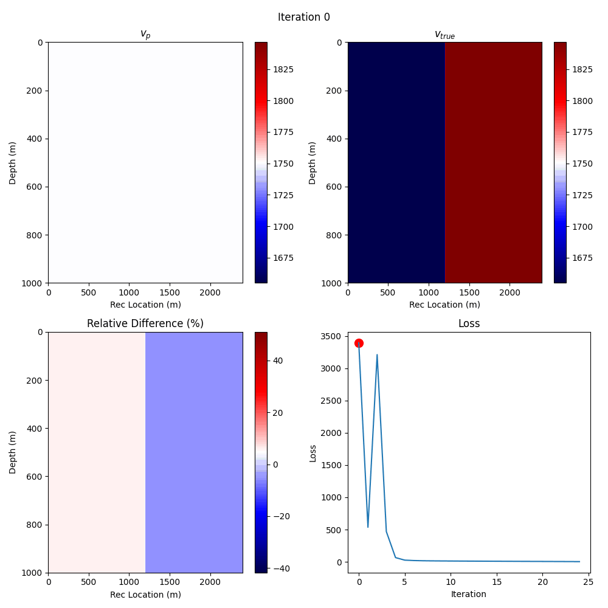
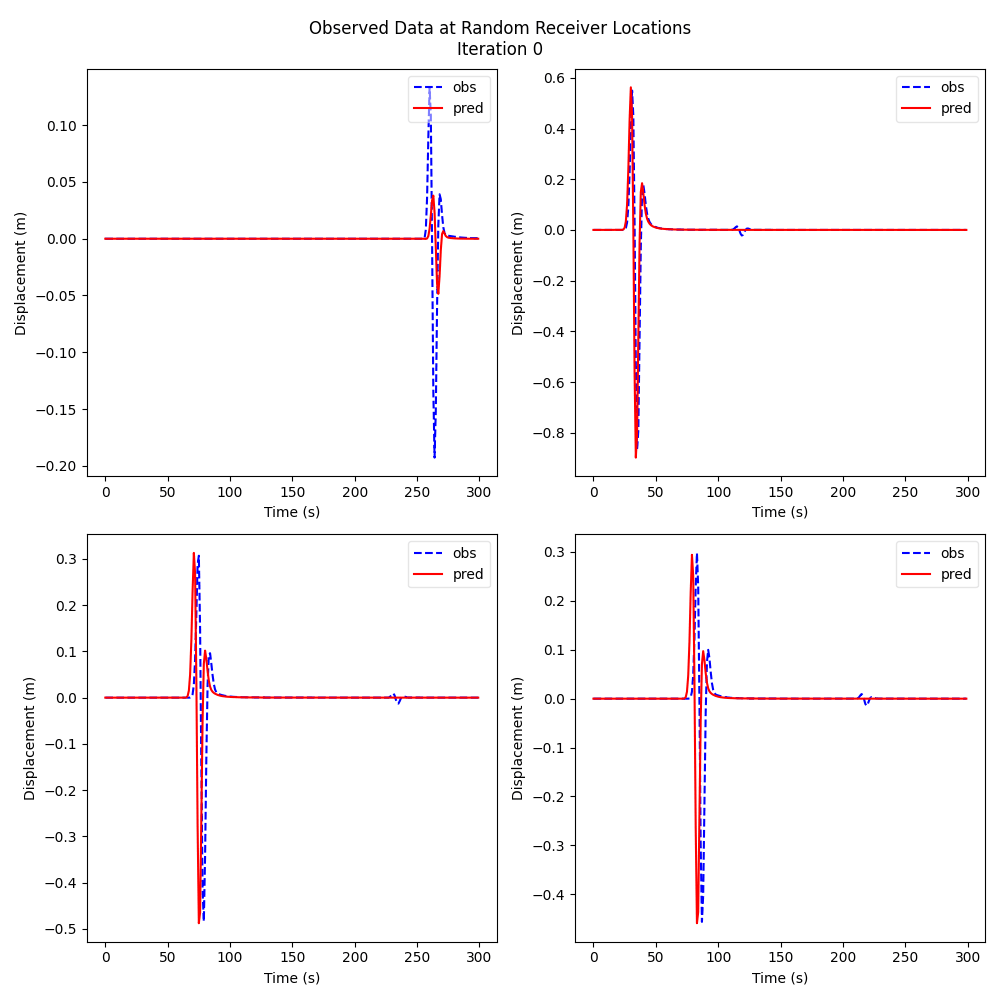

5
=

.. toctree::
   :maxdepth: 4
   :caption: Contents:

Metadata
--------

.. admonition:: Metadata
  :class: toggle

  .. admonition:: score
    :class: toggle

    .. admonition:: vp_compare.yaml
      :class: toggle

      .. code-block:: yaml

        human_timestamp: June 11, 2024 06:17:13 PM
        l2_diff: 60.830810546875
        max_iters: 25
        name: Tikhonov Regularization
        orig_root: /home/tyler/Documents/repos/IslandOfMisfitToys/misfit_toys/hydra/multirun/HYDRA_TIME_2024-06-11/HYDRA_TIME_18-17-13/marmousi/deepwave_example/shots16/35/
        proj_path: marmousi/deepwave_example/shots16
        root: ../../misfit_toys/hydra/multirun/HYDRA_TIME_2024-06-11/HYDRA_TIME_18-17-13/marmousi/deepwave_example/shots16/35
        timestamp: 2024-06-11 18-17-13
        train_time: 125.79025316238403

  .. admonition:: hyperparameters
    :class: toggle

    .. admonition:: config.yaml
      :class: toggle

      .. code-block:: yaml

        case:
          port: 12576
          dupe: true
          editor: null
          name: Tikhonov Regularization
          np: self.runtime.prop.module.meta.nt
          data:
            prefix: conda/data
            proj_path: marmousi/deepwave_example/shots16
            path: conda/data/marmousi/deepwave_example/shots16/twolayer
            preprocess:
              dep: ^^null|misfit_toys.fwi.seismic_data|null
              minv: 1000
              maxv: 2500
              time_pad_frac: 0.2
              path_builder_kw:
                remap:
                  vp_init: vp
                vp_init:
                  runtime_func: self.data.preprocess.dep.ParamConstrained.delay_init
                  kw:
                    minv: ${case.data.preprocess.minv}
                    maxv: ${case.data.preprocess.maxv}
                    requires_grad: true
                src_amp_y:
                  runtime_func: self.data.preprocess.dep.Param.delay_init
                  kw:
                    requires_grad: false
                obs_data: null
                src_loc_y: null
                rec_loc_y: null
              required_fields:
              - vp_init
              - src_amp_y
              - obs_data
              - src_loc_y
              - rec_loc_y
              - meta
              chunk_keys:
                tensors:
                - obs_data
                - src_loc_y
                - rec_loc_y
                params:
                - src_amp_y
            postprocess:
              __call__: ^^null|misfit_toys.beta.postprocess|vp_compare
              kw:
                proj_path: ${...proj_path}
                name: ${case.name}
                max_iters: ${case.train.max_iters}
          plt:
            vp:
              sub:
                shape:
                - 2
                - 2
                kw:
                  figsize:
                  - 10
                  - 10
                adjust:
                  hspace: 0.5
                  wspace: 0.5
              iter:
                none_dims:
                - -2
                - -1
              save:
                path: figs/vp.gif
                movie_format: gif
                duration: 250
              order:
              - vp
              - vp_true
              - rel_diff
              plts:
                vp:
                  main:
                    filt: 'eval(lambda x : x.T)'
                    opts:
                      cmap: seismic
                      aspect: auto
                    title: $v_p$
                    type: imshow
                    xlabel: Rec Location (m)
                    ylabel: Depth (m)
                    colorbar: true
                rel_diff:
                  main:
                    filt: transpose
                    opts:
                      cmap: seismic
                      aspect: auto
                    title: Relative Difference (%)
                    type: imshow
                    xlabel: Rec Location (m)
                    ylabel: Depth (m)
                    colorbar: true
                vp_true:
                  main:
                    filt: transpose
                    opts:
                      cmap: seismic
                      aspect: auto
                    title: $v_{true}$
                    type: imshow
                    xlabel: Rec Location (m)
                    ylabel: Depth (m)
                    colorbar: true
            trace:
              sub:
                shape:
                - 2
                - 2
                kw:
                  figsize:
                  - 10
                  - 10
              iter:
                none_dims:
                - 0
                - -1
              save:
                path: figs/random_traces.gif
                duration: 250
              xlabel: Time (s)
              ylabel: Displacement (m)
              title: Observed Data at Receiver Location
              color_seq:
              - red
              - blue
              linestyles:
              - solid
              - dashed
              legend:
                loc: upper right
                framealpha: 0.5
              suptitle: Observed Data at Random Receiver Locations
          train:
            retrain: true
            max_iters: 25
            loss:
              dep:
                mod: ^^misfit_toys.fwi.loss.tikhonov
              runtime_func: self.train.loss.dep.mod.TikhonovLoss
              kw:
                runtime_func: self.train.loss.dep.mod.lin_reg_drop
                kw:
                  weights: self.runtime.prop.module.vp
                  max_iters: ${case.train.max_iters}
                  scale: 1.0e-05
                  _min: 1.0e-07
            optimizer:
              runtime_func: 'eval(lambda *args, **kw: [torch.optim.LBFGS, kw])'
              args: []
              kw:
                lr: 1.0
                max_iter: 20
                max_eval: null
                tolerance_grad: 1.0e-07
                tolerance_change: 1.0e-09
                history_size: 100
                line_search_fn: null
            stages:
              runtime_func: ^^null|misfit_toys.workflows.stages|vanilla_stages
              kw:
                max_iters: ${case.train.max_iters}
            step:
              runtime_func: ^^null|misfit_toys.workflows.tik.steps|taper_only
              kw:
                length: 100
                num_batches: null
                scale: 1000000.0
              nonexist: checking_the_yaml_format_hook
        run: tik_strength_sweep

    .. admonition:: overrides.yaml
      :class: toggle

      .. code-block:: yaml

        - case=tik
        - case.data.path=conda/data/marmousi/deepwave_example/shots16/twolayer
        - case.train.loss.kw.kw._min=1e-07
        - case.train.max_iters=25
        - case.train.loss.kw.kw.scale=1e-05
        - +run=tik_strength_sweep
        - case.editor=null

  .. admonition:: version control
    :class: toggle

    .. admonition:: git_info.txt
      :class: toggle

      .. code-block:: text

        HASH: d7d2df67cb9cc882c50e4ebc63a9f459d868ef0a
        BRANCH: devel
        
        UNTRACKED FILES: .latest_run
        .vscode/settings.json
        out/loss_record.pt
        out/loss_record_0.pt
        out/loss_record_1.pt
        out/out_record.pt
        out/out_record_0.pt
        out/out_record_1.pt
        out/vp_record.pt
        out/vp_record_0.pt
        out/vp_record_1.pt
        
        ********************************************************************************
        DIFF: 
        ********************************************************************************

  .. admonition:: stdout
    :class: toggle

    .. admonition:: main.log
      :class: toggle

      .. code-block:: text

        Empty file

    .. admonition:: rank_0.out
      :class: toggle

      .. code-block:: text

        Preprocessing took 0.00 seconds.
           Loading /home/tyler/anaconda3/envs/dw/data/marmousi/deepwave_example/shots16/twolayer/vp_init.pt...torch.Size([600, 250])
           Loading /home/tyler/anaconda3/envs/dw/data/marmousi/deepwave_example/shots16/twolayer/src_amp_y.pt...torch.Size([16, 1, 300])
           Loading /home/tyler/anaconda3/envs/dw/data/marmousi/deepwave_example/shots16/twolayer/obs_data.pt...torch.Size([16, 100, 300])
           Loading /home/tyler/anaconda3/envs/dw/data/marmousi/deepwave_example/shots16/twolayer/src_loc_y.pt...torch.Size([16, 1, 2])
           Loading /home/tyler/anaconda3/envs/dw/data/marmousi/deepwave_example/shots16/twolayer/rec_loc_y.pt...torch.Size([16, 100, 2])
        Preprocess time rank 0: 0.42 seconds.
        iter=0, loss=3.13e-03, mse=3.13e-03, tik=0.00e+00, reg_strength=1.00e-05, training.loss: 3.13e+03, lr: 1.000e+00, obs_data.norm: 3.94e+01, out.norm: 4.04e+01, rank: 0
        iter=1, loss=2.73e-04, mse=1.65e-04, tik=1.08e-04, reg_strength=9.60e-06, training.loss: 2.73e+02, lr: 1.000e+00, obs_data.norm: 3.94e+01, out.norm: 3.81e+01, rank: 0
        iter=2, loss=2.87e-03, mse=1.86e-03, tik=1.01e-03, reg_strength=9.20e-06, training.loss: 2.87e+03, lr: 1.000e+00, obs_data.norm: 3.94e+01, out.norm: 3.25e+01, rank: 0
        iter=3, loss=4.39e-04, mse=1.52e-04, tik=2.87e-04, reg_strength=8.80e-06, training.loss: 4.39e+02, lr: 1.000e+00, obs_data.norm: 3.94e+01, out.norm: 3.86e+01, rank: 0
        iter=4, loss=6.32e-05, mse=1.26e-05, tik=5.07e-05, reg_strength=8.40e-06, training.loss: 6.32e+01, lr: 1.000e+00, obs_data.norm: 3.94e+01, out.norm: 3.97e+01, rank: 0
        iter=5, loss=2.53e-05, mse=6.52e-06, tik=1.87e-05, reg_strength=8.00e-06, training.loss: 2.53e+01, lr: 1.000e+00, obs_data.norm: 3.94e+01, out.norm: 3.96e+01, rank: 0
        iter=6, loss=1.98e-05, mse=5.66e-06, tik=1.41e-05, reg_strength=7.60e-06, training.loss: 1.98e+01, lr: 1.000e+00, obs_data.norm: 3.94e+01, out.norm: 3.96e+01, rank: 0
        iter=7, loss=1.72e-05, mse=5.32e-06, tik=1.18e-05, reg_strength=7.20e-06, training.loss: 1.72e+01, lr: 1.000e+00, obs_data.norm: 3.94e+01, out.norm: 3.96e+01, rank: 0
        iter=8, loss=1.55e-05, mse=5.10e-06, tik=1.04e-05, reg_strength=6.80e-06, training.loss: 1.55e+01, lr: 1.000e+00, obs_data.norm: 3.94e+01, out.norm: 3.96e+01, rank: 0
        iter=9, loss=1.43e-05, mse=4.97e-06, tik=9.37e-06, reg_strength=6.40e-06, training.loss: 1.43e+01, lr: 1.000e+00, obs_data.norm: 3.94e+01, out.norm: 3.96e+01, rank: 0
        iter=10, loss=1.33e-05, mse=4.86e-06, tik=8.48e-06, reg_strength=6.00e-06, training.loss: 1.33e+01, lr: 1.000e+00, obs_data.norm: 3.94e+01, out.norm: 3.96e+01, rank: 0
        iter=11, loss=1.25e-05, mse=4.79e-06, tik=7.73e-06, reg_strength=5.60e-06, training.loss: 1.25e+01, lr: 1.000e+00, obs_data.norm: 3.94e+01, out.norm: 3.96e+01, rank: 0
        iter=12, loss=1.18e-05, mse=4.71e-06, tik=7.10e-06, reg_strength=5.20e-06, training.loss: 1.18e+01, lr: 1.000e+00, obs_data.norm: 3.94e+01, out.norm: 3.96e+01, rank: 0
        iter=13, loss=1.11e-05, mse=4.64e-06, tik=6.50e-06, reg_strength=4.80e-06, training.loss: 1.11e+01, lr: 1.000e+00, obs_data.norm: 3.94e+01, out.norm: 3.96e+01, rank: 0
        iter=14, loss=1.05e-05, mse=4.56e-06, tik=5.97e-06, reg_strength=4.40e-06, training.loss: 1.05e+01, lr: 1.000e+00, obs_data.norm: 3.94e+01, out.norm: 3.96e+01, rank: 0
        iter=15, loss=9.97e-06, mse=4.48e-06, tik=5.49e-06, reg_strength=4.00e-06, training.loss: 9.97e+00, lr: 1.000e+00, obs_data.norm: 3.94e+01, out.norm: 3.96e+01, rank: 0
        iter=16, loss=9.38e-06, mse=4.39e-06, tik=4.99e-06, reg_strength=3.60e-06, training.loss: 9.38e+00, lr: 1.000e+00, obs_data.norm: 3.94e+01, out.norm: 3.96e+01, rank: 0
        iter=17, loss=8.82e-06, mse=4.31e-06, tik=4.50e-06, reg_strength=3.20e-06, training.loss: 8.82e+00, lr: 1.000e+00, obs_data.norm: 3.94e+01, out.norm: 3.96e+01, rank: 0
        iter=18, loss=8.25e-06, mse=4.22e-06, tik=4.02e-06, reg_strength=2.80e-06, training.loss: 8.25e+00, lr: 1.000e+00, obs_data.norm: 3.94e+01, out.norm: 3.96e+01, rank: 0
        iter=19, loss=7.67e-06, mse=4.14e-06, tik=3.54e-06, reg_strength=2.40e-06, training.loss: 7.67e+00, lr: 1.000e+00, obs_data.norm: 3.94e+01, out.norm: 3.96e+01, rank: 0
        iter=20, loss=7.09e-06, mse=4.02e-06, tik=3.08e-06, reg_strength=2.00e-06, training.loss: 7.09e+00, lr: 1.000e+00, obs_data.norm: 3.94e+01, out.norm: 3.95e+01, rank: 0
        iter=21, loss=6.48e-06, mse=3.89e-06, tik=2.59e-06, reg_strength=1.60e-06, training.loss: 6.48e+00, lr: 1.000e+00, obs_data.norm: 3.94e+01, out.norm: 3.95e+01, rank: 0
        iter=22, loss=5.82e-06, mse=3.75e-06, tik=2.07e-06, reg_strength=1.20e-06, training.loss: 5.82e+00, lr: 1.000e+00, obs_data.norm: 3.94e+01, out.norm: 3.95e+01, rank: 0
        iter=23, loss=5.10e-06, mse=3.55e-06, tik=1.55e-06, reg_strength=8.00e-07, training.loss: 5.10e+00, lr: 1.000e+00, obs_data.norm: 3.94e+01, out.norm: 3.95e+01, rank: 0
        iter=24, loss=4.21e-06, mse=3.20e-06, tik=1.01e-06, reg_strength=4.00e-07, training.loss: 4.21e+00, lr: 1.000e+00, obs_data.norm: 3.94e+01, out.norm: 3.95e+01, rank: 0
        Presaving loss
        Presaving vp
        Presaving out
        Train time rank 0: 120.38 seconds.

    .. admonition:: rank_1.out
      :class: toggle

      .. code-block:: text

        Preprocessing took 0.00 seconds.
           Loading /home/tyler/anaconda3/envs/dw/data/marmousi/deepwave_example/shots16/twolayer/vp_init.pt...torch.Size([600, 250])
           Loading /home/tyler/anaconda3/envs/dw/data/marmousi/deepwave_example/shots16/twolayer/src_amp_y.pt...torch.Size([16, 1, 300])
           Loading /home/tyler/anaconda3/envs/dw/data/marmousi/deepwave_example/shots16/twolayer/obs_data.pt...torch.Size([16, 100, 300])
           Loading /home/tyler/anaconda3/envs/dw/data/marmousi/deepwave_example/shots16/twolayer/src_loc_y.pt...torch.Size([16, 1, 2])
           Loading /home/tyler/anaconda3/envs/dw/data/marmousi/deepwave_example/shots16/twolayer/rec_loc_y.pt...torch.Size([16, 100, 2])
        Preprocess time rank 1: 0.30 seconds.
        iter=0, loss=3.66e-03, mse=3.66e-03, tik=0.00e+00, reg_strength=1.00e-05, training.loss: 3.66e+03, lr: 1.000e+00, obs_data.norm: 3.98e+01, out.norm: 4.07e+01, rank: 1
        iter=1, loss=8.00e-04, mse=6.92e-04, tik=1.08e-04, reg_strength=9.60e-06, training.loss: 8.00e+02, lr: 1.000e+00, obs_data.norm: 3.98e+01, out.norm: 3.57e+01, rank: 1
        iter=2, loss=3.55e-03, mse=2.53e-03, tik=1.01e-03, reg_strength=9.20e-06, training.loss: 3.55e+03, lr: 1.000e+00, obs_data.norm: 3.98e+01, out.norm: 3.48e+01, rank: 1
        iter=3, loss=5.00e-04, mse=2.13e-04, tik=2.87e-04, reg_strength=8.80e-06, training.loss: 5.00e+02, lr: 1.000e+00, obs_data.norm: 3.98e+01, out.norm: 3.83e+01, rank: 1
        iter=4, loss=6.94e-05, mse=1.87e-05, tik=5.07e-05, reg_strength=8.40e-06, training.loss: 6.94e+01, lr: 1.000e+00, obs_data.norm: 3.98e+01, out.norm: 3.99e+01, rank: 1
        iter=5, loss=2.91e-05, mse=1.03e-05, tik=1.87e-05, reg_strength=8.00e-06, training.loss: 2.91e+01, lr: 1.000e+00, obs_data.norm: 3.98e+01, out.norm: 4.00e+01, rank: 1
        iter=6, loss=2.15e-05, mse=7.39e-06, tik=1.41e-05, reg_strength=7.60e-06, training.loss: 2.15e+01, lr: 1.000e+00, obs_data.norm: 3.98e+01, out.norm: 4.00e+01, rank: 1
        iter=7, loss=1.78e-05, mse=5.98e-06, tik=1.18e-05, reg_strength=7.20e-06, training.loss: 1.78e+01, lr: 1.000e+00, obs_data.norm: 3.98e+01, out.norm: 4.01e+01, rank: 1
        iter=8, loss=1.58e-05, mse=5.42e-06, tik=1.04e-05, reg_strength=6.80e-06, training.loss: 1.58e+01, lr: 1.000e+00, obs_data.norm: 3.98e+01, out.norm: 4.01e+01, rank: 1
        iter=9, loss=1.45e-05, mse=5.14e-06, tik=9.37e-06, reg_strength=6.40e-06, training.loss: 1.45e+01, lr: 1.000e+00, obs_data.norm: 3.98e+01, out.norm: 4.01e+01, rank: 1
        iter=10, loss=1.34e-05, mse=4.95e-06, tik=8.48e-06, reg_strength=6.00e-06, training.loss: 1.34e+01, lr: 1.000e+00, obs_data.norm: 3.98e+01, out.norm: 4.01e+01, rank: 1
        iter=11, loss=1.25e-05, mse=4.81e-06, tik=7.73e-06, reg_strength=5.60e-06, training.loss: 1.25e+01, lr: 1.000e+00, obs_data.norm: 3.98e+01, out.norm: 4.01e+01, rank: 1
        iter=12, loss=1.17e-05, mse=4.63e-06, tik=7.10e-06, reg_strength=5.20e-06, training.loss: 1.17e+01, lr: 1.000e+00, obs_data.norm: 3.98e+01, out.norm: 4.01e+01, rank: 1
        iter=13, loss=1.10e-05, mse=4.49e-06, tik=6.50e-06, reg_strength=4.80e-06, training.loss: 1.10e+01, lr: 1.000e+00, obs_data.norm: 3.98e+01, out.norm: 4.01e+01, rank: 1
        iter=14, loss=1.03e-05, mse=4.33e-06, tik=5.97e-06, reg_strength=4.40e-06, training.loss: 1.03e+01, lr: 1.000e+00, obs_data.norm: 3.98e+01, out.norm: 4.01e+01, rank: 1
        iter=15, loss=9.64e-06, mse=4.15e-06, tik=5.49e-06, reg_strength=4.00e-06, training.loss: 9.64e+00, lr: 1.000e+00, obs_data.norm: 3.98e+01, out.norm: 4.01e+01, rank: 1
        iter=16, loss=8.97e-06, mse=3.98e-06, tik=4.99e-06, reg_strength=3.60e-06, training.loss: 8.97e+00, lr: 1.000e+00, obs_data.norm: 3.98e+01, out.norm: 4.01e+01, rank: 1
        iter=17, loss=8.34e-06, mse=3.83e-06, tik=4.50e-06, reg_strength=3.20e-06, training.loss: 8.34e+00, lr: 1.000e+00, obs_data.norm: 3.98e+01, out.norm: 4.01e+01, rank: 1
        iter=18, loss=7.70e-06, mse=3.67e-06, tik=4.02e-06, reg_strength=2.80e-06, training.loss: 7.70e+00, lr: 1.000e+00, obs_data.norm: 3.98e+01, out.norm: 4.01e+01, rank: 1
        iter=19, loss=7.06e-06, mse=3.52e-06, tik=3.54e-06, reg_strength=2.40e-06, training.loss: 7.06e+00, lr: 1.000e+00, obs_data.norm: 3.98e+01, out.norm: 4.01e+01, rank: 1
        iter=20, loss=6.42e-06, mse=3.34e-06, tik=3.08e-06, reg_strength=2.00e-06, training.loss: 6.42e+00, lr: 1.000e+00, obs_data.norm: 3.98e+01, out.norm: 4.01e+01, rank: 1
        iter=21, loss=5.76e-06, mse=3.17e-06, tik=2.59e-06, reg_strength=1.60e-06, training.loss: 5.76e+00, lr: 1.000e+00, obs_data.norm: 3.98e+01, out.norm: 4.01e+01, rank: 1
        iter=22, loss=5.08e-06, mse=3.00e-06, tik=2.07e-06, reg_strength=1.20e-06, training.loss: 5.08e+00, lr: 1.000e+00, obs_data.norm: 3.98e+01, out.norm: 4.00e+01, rank: 1
        iter=23, loss=4.34e-06, mse=2.79e-06, tik=1.55e-06, reg_strength=8.00e-07, training.loss: 4.34e+00, lr: 1.000e+00, obs_data.norm: 3.98e+01, out.norm: 4.00e+01, rank: 1
        iter=24, loss=3.49e-06, mse=2.48e-06, tik=1.01e-06, reg_strength=4.00e-07, training.loss: 3.49e+00, lr: 1.000e+00, obs_data.norm: 3.98e+01, out.norm: 4.00e+01, rank: 1
        Presaving loss
        Presaving vp
        Presaving out
        Train time rank 1: 120.38 seconds.

  .. admonition:: stderr
    :class: toggle

    .. admonition:: rank_0.err
      :class: toggle

      .. code-block:: text

        Empty file

    .. admonition:: rank_1.err
      :class: toggle

      .. code-block:: text

        Empty file

  .. admonition:: other
    :class: toggle

    .. admonition:: hydra.yaml
      :class: toggle

      .. code-block:: yaml

        hydra:
          run:
            dir: outputs/HYDRA_TIME_${now:%Y-%m-%d}/HYDRA_TIME_${now:%H-%M-%S}/${case.data.proj_path}
          sweep:
            dir: multirun/HYDRA_TIME_${now:%Y-%m-%d}/HYDRA_TIME_${now:%H-%M-%S}/${case.data.proj_path}
            subdir: ${hydra.job.num}
          launcher:
            _target_: hydra._internal.core_plugins.basic_launcher.BasicLauncher
          sweeper:
            _target_: hydra._internal.core_plugins.basic_sweeper.BasicSweeper
            max_batch_size: null
            params: null
          help:
            app_name: ${hydra.job.name}
            header: '${hydra.help.app_name} is powered by Hydra.
        
              '
            footer: 'Powered by Hydra (https://hydra.cc)
        
              Use --hydra-help to view Hydra specific help
        
              '
            template: '${hydra.help.header}
        
              == Configuration groups ==
        
              Compose your configuration from those groups (group=option)
        
        
              $APP_CONFIG_GROUPS
        
        
              == Config ==
        
              Override anything in the config (foo.bar=value)
        
        
              $CONFIG
        
        
              ${hydra.help.footer}
        
              '
          hydra_help:
            template: 'Hydra (${hydra.runtime.version})
        
              See https://hydra.cc for more info.
        
        
              == Flags ==
        
              $FLAGS_HELP
        
        
              == Configuration groups ==
        
              Compose your configuration from those groups (For example, append hydra/job_logging=disabled
              to command line)
        
        
              $HYDRA_CONFIG_GROUPS
        
        
              Use ''--cfg hydra'' to Show the Hydra config.
        
              '
            hydra_help: ???
          hydra_logging:
            version: 1
            formatters:
              simple:
                format: '[%(asctime)s][HYDRA] %(message)s'
            handlers:
              console:
                class: logging.StreamHandler
                formatter: simple
                stream: ext://sys.stdout
            root:
              level: INFO
              handlers:
              - console
            loggers:
              logging_example:
                level: DEBUG
            disable_existing_loggers: false
          job_logging:
            version: 1
            formatters:
              simple:
                format: '[%(asctime)s][%(name)s][%(levelname)s] - %(message)s'
            handlers:
              console:
                class: logging.StreamHandler
                formatter: simple
                stream: ext://sys.stdout
              file:
                class: logging.FileHandler
                formatter: simple
                filename: ${hydra.runtime.output_dir}/${hydra.job.name}.log
            root:
              level: INFO
              handlers:
              - console
              - file
            disable_existing_loggers: false
          env: {}
          mode: MULTIRUN
          searchpath: []
          callbacks: {}
          output_subdir: ''
          overrides:
            hydra:
            - hydra.mode=MULTIRUN
            task:
            - case=tik
            - case.data.path=conda/data/marmousi/deepwave_example/shots16/twolayer
            - case.train.loss.kw.kw._min=1e-07
            - case.train.max_iters=25
            - case.train.loss.kw.kw.scale=1e-05
            - +run=tik_strength_sweep
            - case.editor=null
          job:
            name: main
            chdir: null
            override_dirname: +run=tik_strength_sweep,case.data.path=conda/data/marmousi/deepwave_example/shots16/twolayer,case.editor=null,case.train.loss.kw.kw._min=1e-07,case.train.loss.kw.kw.scale=1e-05,case.train.max_iters=25,case=tik
            id: '35'
            num: 35
            config_name: cfg
            env_set: {}
            env_copy: []
            config:
              override_dirname:
                kv_sep: '='
                item_sep: ','
                exclude_keys: []
          runtime:
            version: 1.3.2
            version_base: '1.3'
            cwd: /home/tyler/Documents/repos/IslandOfMisfitToys/misfit_toys/hydra
            config_sources:
            - path: hydra.conf
              schema: pkg
              provider: hydra
            - path: /home/tyler/Documents/repos/IslandOfMisfitToys/misfit_toys/hydra/cfg
              schema: file
              provider: main
            - path: ''
              schema: structured
              provider: schema
            output_dir: /home/tyler/Documents/repos/IslandOfMisfitToys/misfit_toys/hydra/multirun/HYDRA_TIME_2024-06-11/HYDRA_TIME_18-17-13/marmousi/deepwave_example/shots16/35
            choices:
              case: tik
              case/train/step: tik
              case/train/stages: vanilla
              case/train/optimizer: lbfgs
              case/train/loss: tik
              case/train: train
              case/plt: plt
              case/data/postprocess: simple
              case/data/preprocess: constrained_vel
              case/data: data
              hydra/env: default
              hydra/callbacks: null
              hydra/job_logging: default
              hydra/hydra_logging: default
              hydra/hydra_help: default
              hydra/help: default
              hydra/sweeper: basic
              hydra/launcher: basic
              hydra/output: default
          verbose: false

    .. admonition:: resolved_config.yaml
      :class: toggle

      .. code-block:: yaml

        case: 
          data: 
            path: conda/data/marmousi/deepwave_example/shots16/twolayer
            postprocess: 
              __call__: ^^null|misfit_toys.beta.postprocess|vp_compare
              kw: 
                max_iters: 25
                name: Tikhonov Regularization
                proj_path: marmousi/deepwave_example/shots16
            prefix: conda/data
            preprocess: 
              chunk_keys: 
                params:
                - src_amp_y
                tensors:
                - obs_data
                - src_loc_y
                - rec_loc_y
              dep: ^^null|misfit_toys.fwi.seismic_data|null
              maxv: 2500
              minv: 1000
              path_builder_kw: 
                obs_data: null
                rec_loc_y: null
                remap: 
                  vp_init: vp
                src_amp_y: 
                  kw: 
                    requires_grad: false
                  runtime_func: self.data.preprocess.dep.Param.delay_init
                src_loc_y: null
                vp_init: 
                  kw: 
                    maxv: 2500
                    minv: 1000
                    requires_grad: true
                  runtime_func: self.data.preprocess.dep.ParamConstrained.delay_init
              required_fields:
              - vp_init
              - src_amp_y
              - obs_data
              - src_loc_y
              - rec_loc_y
              - meta
              time_pad_frac: 0.2
            proj_path: marmousi/deepwave_example/shots16
          dupe: true
          editor: null
          name: Tikhonov Regularization
          np: self.runtime.prop.module.meta.nt
          plt: 
            trace: 
              color_seq:
              - red
              - blue
              iter: 
                none_dims:
                - 0
                - -1
              legend: 
                framealpha: 0.5
                loc: upper right
              linestyles:
              - solid
              - dashed
              save: 
                duration: 250
                path: figs/random_traces.gif
              sub: 
                kw: 
                  figsize:
                  - 10
                  - 10
                shape:
                - 2
                - 2
              suptitle: Observed Data at Random Receiver Locations
              title: Observed Data at Receiver Location
              xlabel: Time (s)
              ylabel: Displacement (m)
            vp: 
              iter: 
                none_dims:
                - -2
                - -1
              order:
              - vp
              - vp_true
              - rel_diff
              plts: 
                rel_diff: 
                  main: 
                    colorbar: true
                    filt: transpose
                    opts: 
                      aspect: auto
                      cmap: seismic
                    title: Relative Difference (%)
                    type: imshow
                    xlabel: Rec Location (m)
                    ylabel: Depth (m)
                vp: 
                  main: 
                    colorbar: true
                    filt: 'eval(lambda x : x.T)'
                    opts: 
                      aspect: auto
                      cmap: seismic
                    title: $v_p$
                    type: imshow
                    xlabel: Rec Location (m)
                    ylabel: Depth (m)
                vp_true: 
                  main: 
                    colorbar: true
                    filt: transpose
                    opts: 
                      aspect: auto
                      cmap: seismic
                    title: $v_{true}$
                    type: imshow
                    xlabel: Rec Location (m)
                    ylabel: Depth (m)
              save: 
                duration: 250
                movie_format: gif
                path: figs/vp.gif
              sub: 
                adjust: 
                  hspace: 0.5
                  wspace: 0.5
                kw: 
                  figsize:
                  - 10
                  - 10
                shape:
                - 2
                - 2
          port: 12576
          train: 
            loss: 
              dep: 
                mod: ^^misfit_toys.fwi.loss.tikhonov
              kw: 
                kw: 
                  _min: 1.0e-07
                  max_iters: 25
                  scale: 1.0e-05
                  weights: self.runtime.prop.module.vp
                runtime_func: self.train.loss.dep.mod.lin_reg_drop
              runtime_func: self.train.loss.dep.mod.TikhonovLoss
            max_iters: 25
            optimizer: 
              args: []
              kw: 
                history_size: 100
                line_search_fn: null
                lr: 1.0
                max_eval: null
                max_iter: 20
                tolerance_change: 1.0e-09
                tolerance_grad: 1.0e-07
              runtime_func: 'eval(lambda *args, **kw: [torch.optim.LBFGS, kw])'
            retrain: true
            stages: 
              kw: 
                max_iters: 25
              runtime_func: ^^null|misfit_toys.workflows.stages|vanilla_stages
            step: 
              kw: 
                length: 100
                num_batches: null
                scale: 1000000.0
              nonexist: checking_the_yaml_format_hook
              runtime_func: ^^null|misfit_toys.workflows.tik.steps|taper_only
        run: tik_strength_sweep

vp
--

random_traces
-------------

